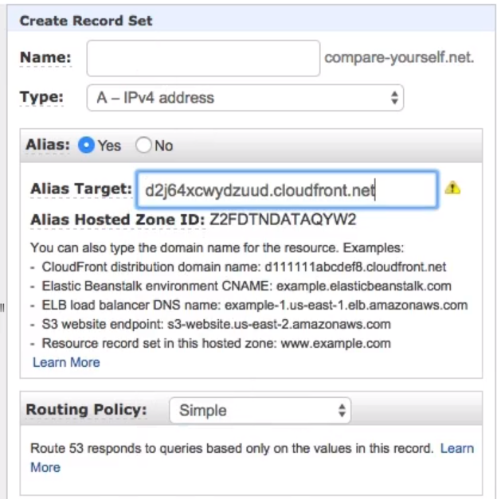

# Using a custom domain with route 53

The Route 53 is a simple DNS server.

AWS Route53 Overview: https://aws.amazon.com/route53/

AWS Route53 Developer Guide: http://docs.aws.amazon.com/Route53/latest/DeveloperGuide/Welcome.html

AWS Route53 Pricing: https://aws.amazon.com/route53/pricing/

AWS Route53 - Registering a Domain: http://docs.aws.amazon.com/Route53/latest/DeveloperGuide/registrar.html

## Registering a domain

We can go to `AWS Console -> Route 53 -> Register a domain`.
Select a name, go to checking out process, after a while it will be processed.

## Connecting a domain to a cloudfront distribution

When you have set up your domain, you can create a new recordset with an alias target to your generated cloudfront url.

