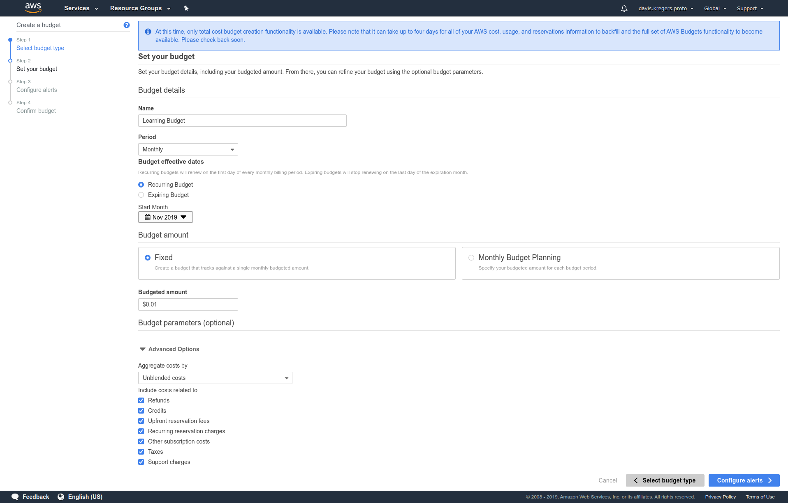
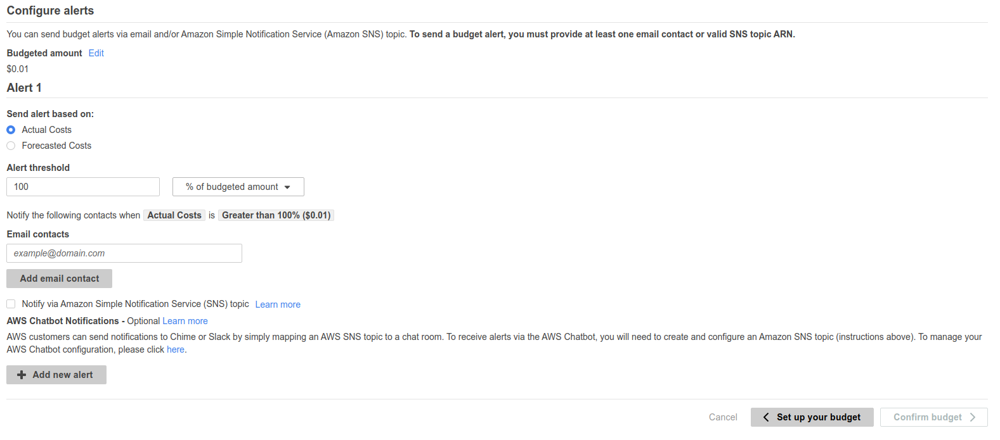

# AWS Budget Setup

As mentioned in previous section, most of the course will utilize free tier, but in case our account does go over it, we will setup budget so we receive a notification when exceeding the free tier and not spending too much.

In order to do this, we go click on `My Account` and going to `My Billing Dashboard`, Then on the left side there will be an option called `Budgets`.

Then click on a `Create Budget` -> `Cost Budget`.

When configuring alerts, we'll set an alert on $0.01, so we'll know when we have exceeded the free tier.

