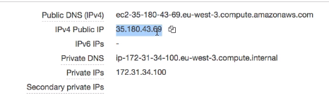
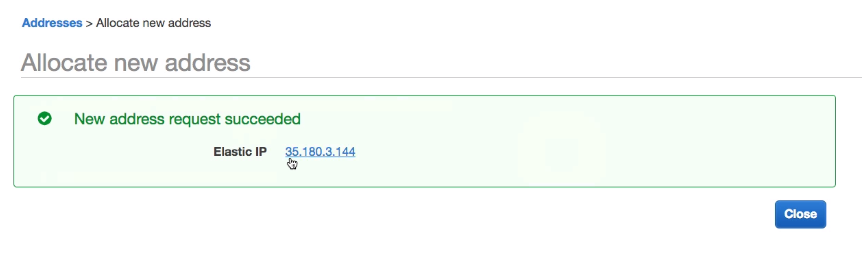
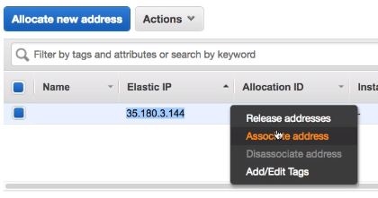

# Private vs Public vs Elastic IP

- Public IP
    - The machine can be identified on the internet
    - Must be unique accross the whole web
    - Can be geo-located easily
- Private IP
    - Private IP means the machine only be identified on a private network
    - The IP must be unique accross the private network
    - But two different private networks (two companies) can have the same IPs
    - Machines connect to internet through a gateway
    - Only a specified range of IPs can be used as a private IP
- Elastic IPs
    - When you stop and then start an EC2 instance, it can change it's public IP
    - If you need to have a fixed public IP for yourt instance, you need an Elastic IP
    - An elastic IP is a public IPv4 IP you own as long as you don't delete it
    - You can attach to it one instance at a time
    - With an Elastic IP address, you can mask the failure of an instance or software by rapidly remapping the address to another instance on your account
    - You can only have 5 Elastic IP in your account (you can ask AWS to increase that)
    - Overall, try to avoid using Elastic IP
        - They often reflect poor architectural decisions
        - Instead, use a random public IP and register a DNS name to it
        - Or use a Load Balancer and don't use a public IP at all

By default, your EC2 machine comes with:
- A private IP for internal AWS network
- A public IP for the internet

When we are doing ssh into our ec2 machines:
- We can't use a private IP, because we are not in the same network
- We can only use the public IP

If your machine is stopped and then started, the public IP can change

When viewing the EC2 instance, we can see these IP addresses:

You can also visit the `Elastic IPs` section and allocate new Elastic IP adresses.

Once it's created, we can associate it with an instance.

