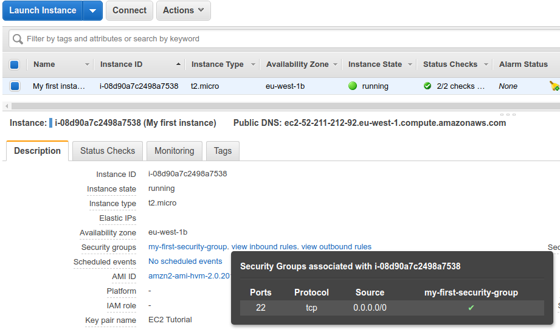
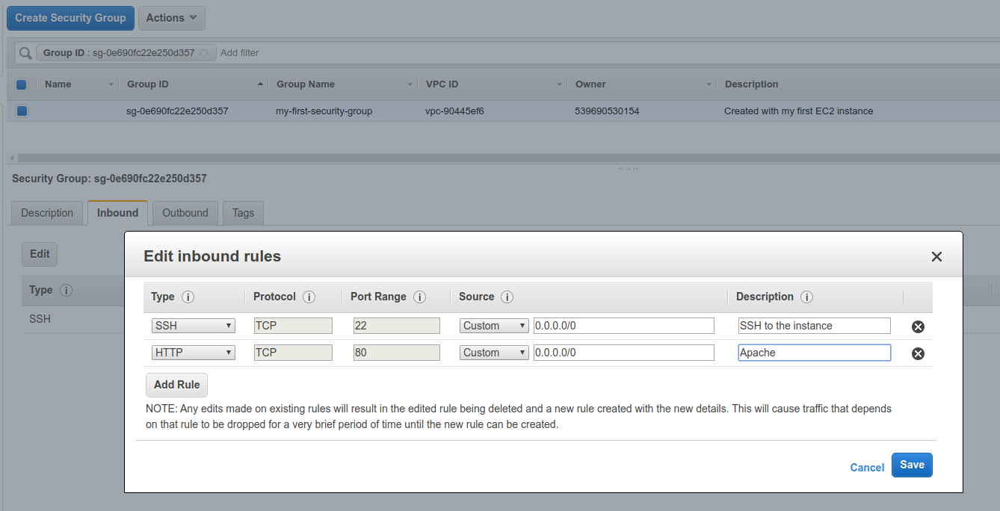
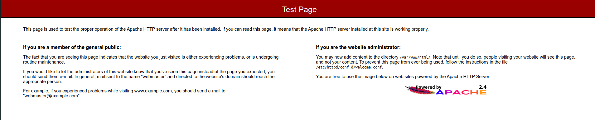

# Install Apache on EC2

The first step is - we [ssh into our ec2 machine](06-ssh-overview.md).

```bash
➜  notes git:(master) ✗ ssh -i ~/Downloads/EC2Tutorial.pem ec2-user@52.211.212.92
Last login: Fri Nov 22 09:29:22 2019 from ec2-18-202-216-48.eu-west-1.compute.amazonaws.com

       __|  __|_  )
       _|  (     /   Amazon Linux 2 AMI
      ___|\___|___|

https://aws.amazon.com/amazon-linux-2/
5 package(s) needed for security, out of 13 available
Run "sudo yum update" to apply all updates.
[ec2-user@ip-172-31-41-154 ~]$ sudo su
[root@ip-172-31-41-154 ec2-user]# yum update -y
[root@ip-172-31-41-154 ec2-user]# yum install -y httpd.x86_64
[root@ip-172-31-41-154 ec2-user]# systemctl start httpd.service
[root@ip-172-31-41-154 ec2-user]# systemctl enable httpd.service
Created symlink from /etc/systemd/system/multi-user.target.wants/httpd.service to /usr/lib/systemd/system/httpd.service.
[root@ip-172-31-41-154 ec2-user]# curl localhost:80
<!DOCTYPE html PUBLIC "-//W3C//DTD XHTML 1.1//EN" "http://www.w3.org/TR/xhtml11/DTD/xhtml11.dtd">

<html xmlns="http://www.w3.org/1999/xhtml" xml:lang="en">
	<head>
		<title>Test Page for the Apache HTTP Server</title>
...


```

If we grab the Public IP and visit it from browser, it will time out, since we haven't configured the security group. We are listening only to ssh connections.



We can go to the security group and edit it, add an HTTP inbound rule.



Now we can visit the public IP and it will be accessible.

