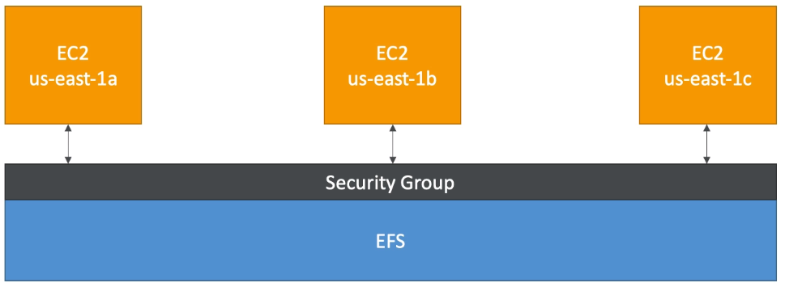

# EFS - Elastic File System

- Managed NFS (network file system) that can be mounted on many EC2
- EFS works with EC2 instances in multi-AZ
- Highly available, scalable, expensive (3x gp2), pay per use
- Use cases:
    - Content management
    - Web serving
    - Data sharing
    - Wordpress
- Uses NFSv4.1 protocol
- Uses security group to control access to EFS
- Compatible with Linux based AMI (not Windows)
- Performance mode:
    - General purpose (default)
    - MAX I/O  - used when thousands of ec2 are using the EFS
- EFS file sync to sync from on-premise file system to EFS
- Backup EFS-to-EFS (incremental - can choose frequency)
- Encryption at rest using KMS

