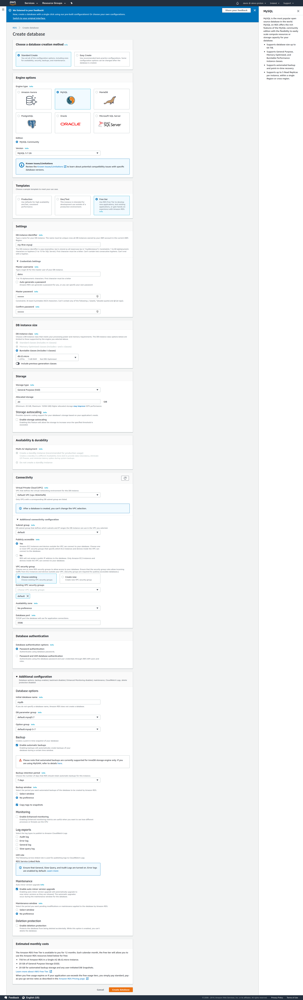
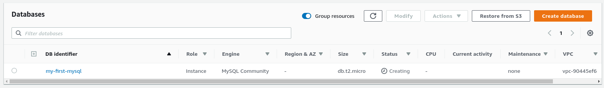
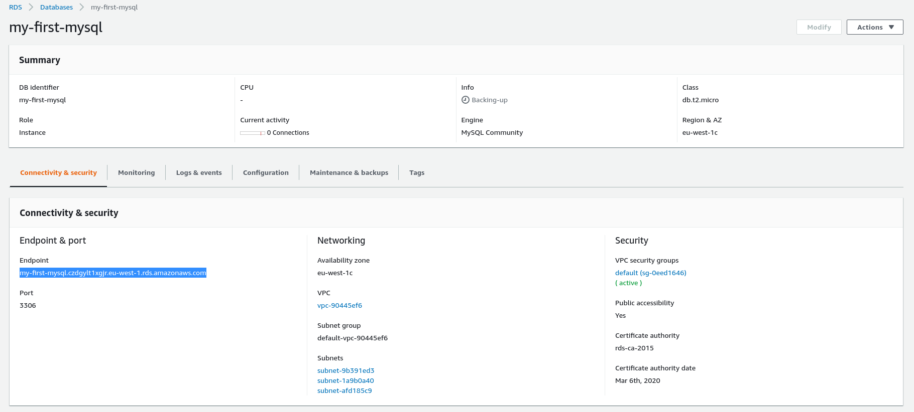
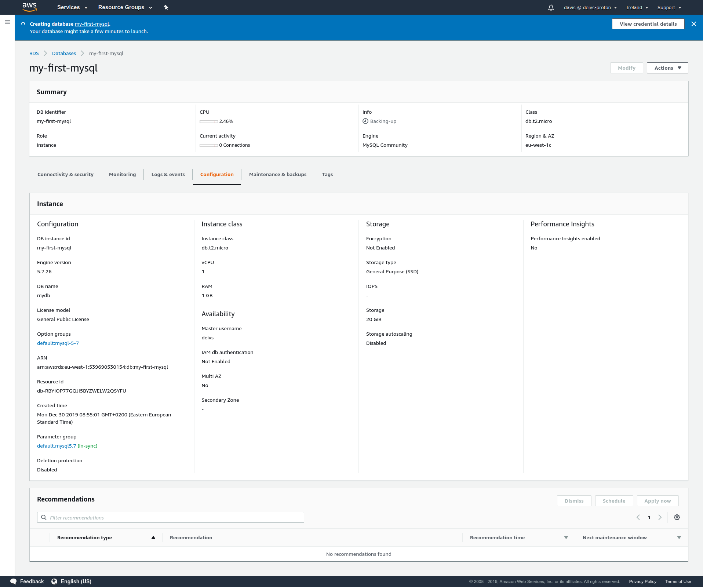
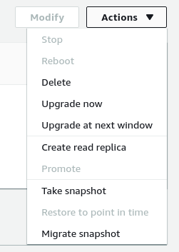

# RDS Hands on

We can go to the `RDS section` in AWS. And click on `create a database`. We are going to use `Standard Create` and `MySQL` because the aurora does not provide free tier.

Then we need:
- Set a template (production, dev/test/free tier)
- Specify identifier
- Specify admin credentials
- Choose instance type
- Specify storage
- Choose whether to use Multi-AZ deployment
- Choose the VPC to deploy to, security groups, publicly accessable?
- Setup additional configuration
    - Backups
    - Monitoring
    - Logging
    - Maintenance
    - Deletion prevention

Normally we wouldn't want for the Database to be publicly accessible, but we are going to select it for testing purposes.

Once everything is set up, the instance will need a few minutes to deploy.

Once that is done, we can grab the endpoint URL and connect to it:

When opening up the database section, we can see all the configuration, monitoring dashboards etc.

We can also take multiple actions like delete database, upgrade it, create replicas or snapshots, migrate them to other regions.

