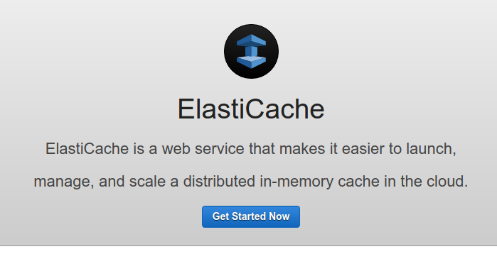
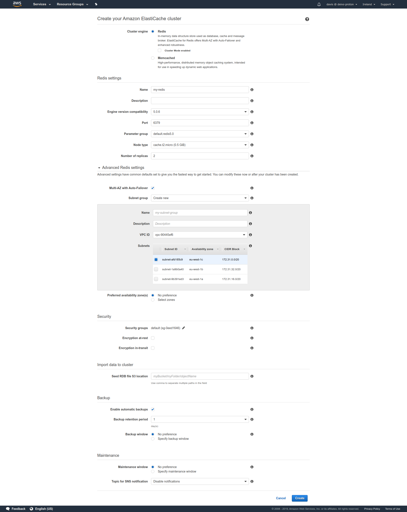

# ElastiCache hands on

We can navigate to `ElastiCache` from the AWS console and click on `Get Started Now`.

Ther we can choose either to use Redis or Memcached. Then we can set configuration, AZs, failover, encryption, backups and maintenance windows.

