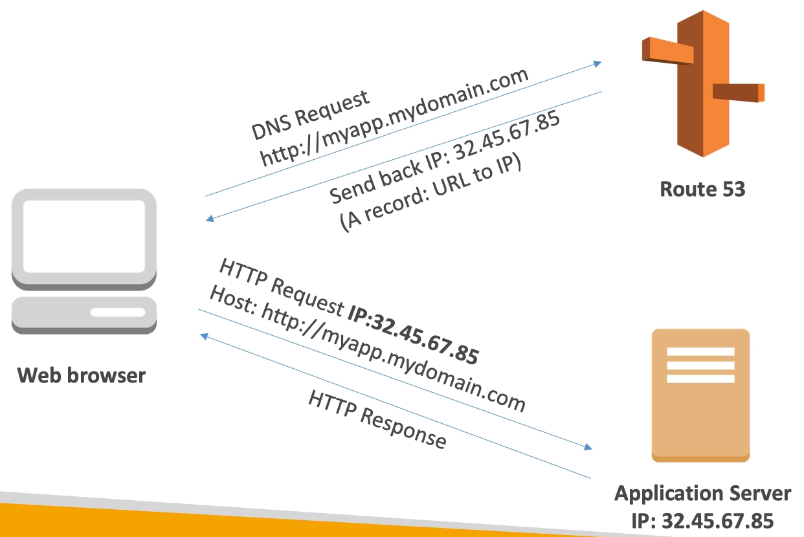

# AWS Route 53 Overview

- Route53 is a Managed DNS (Domain Name System)
- DNS is a collection of rules and records which helps clients understand how to reach a server through URLs
- In AWS, the most common records are:
    - A: URL to IPv4
    - AAAA: URL to IPv6
    - CNAME: URL to URL
    - Alias: URL to AWS resource

- Route53 can use:
    - public domain names you own (or buy)
    - private domain domain names that can be resolved by your instances in your VPCs
- Route53 has advanced features such as:
    - Load balancing (through DNS - also called client load balancing)
    - Health checks (although limited)
    - Routing policy: simple, failover, geolocation, latency, weighted, multi value

You pay $0.50 per month per hosted zone.