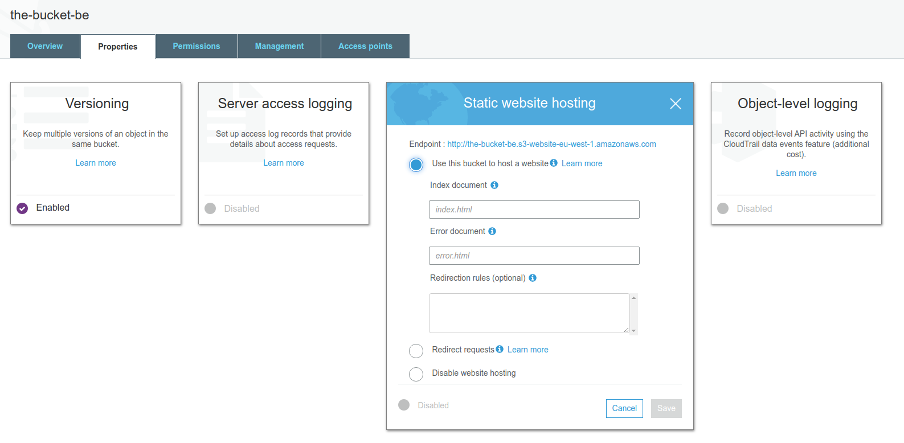
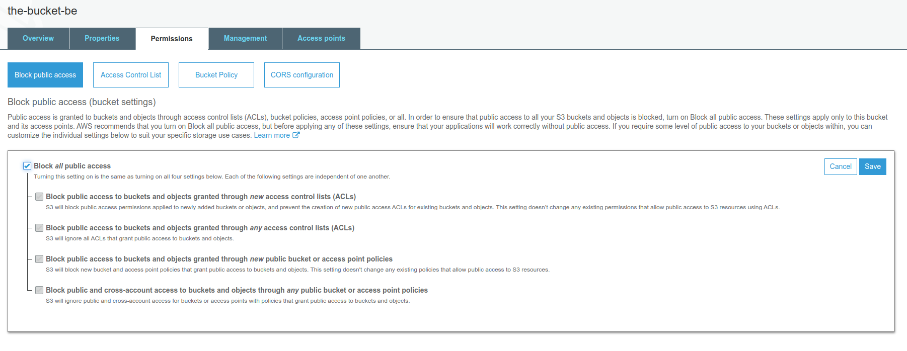

# AWS S3 Websites

- S3 can host static websites and have them accessible on the www
- The website URL will be `<bucket-name>.s3-website-<aws-region>.amazonaws.com` OR `<bucket-name>.s3-website.<aws-region>.amazonaws.com`
- If you get a 403 (forbidden) error, make sure the bucket policy allows public reads.





```json
{
    "Id": "Policy1537533827691",
    "Version": "2012-10-17",
    "Statement": [
        {
            "Sid": "Stmt1537533826523",
            "Action": [
                "s3:GetOBject"
            ],
            "Effect": "Allow",
            "Resource": "arm:aws:s3::::thebucket/*",
            "Principal": "*"
        }
    ]
}
```