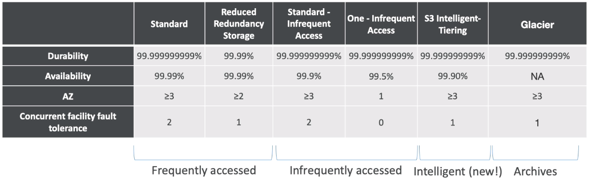
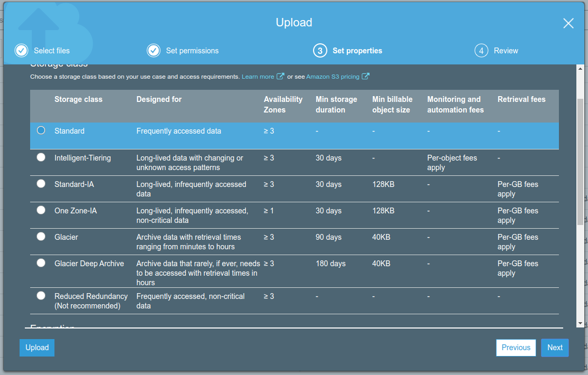
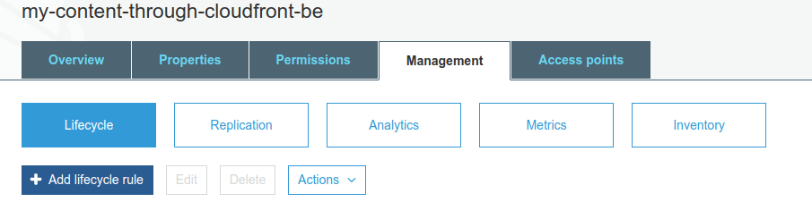
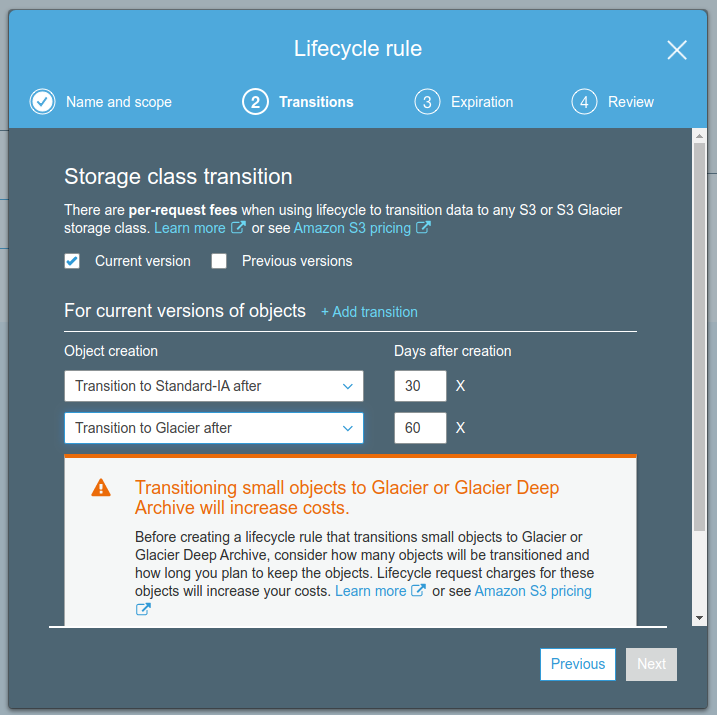
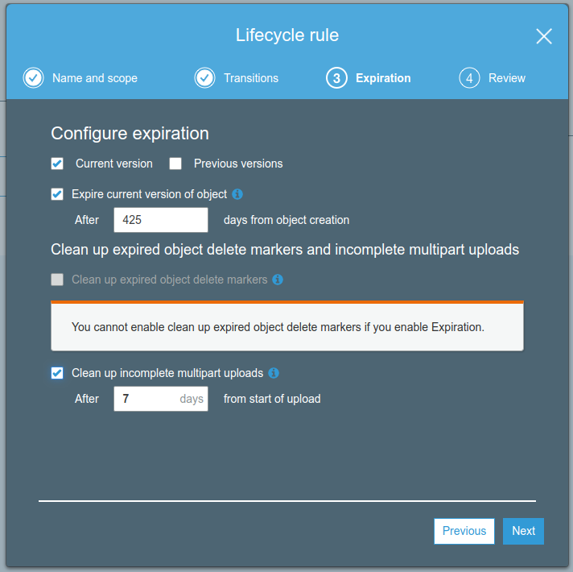

# S3 Storage Tiers

- Amazon S3 Standard - General Purpose
    - High durability (99.999999999%) of objects accross multiple AZ
    - If you store 10,000,000 objects with Amazon S3, you can on average expect to incur a loss of a single object once every 10,000 years.
    - 99.99% availability over a given year
    - Sustain 2 concurrent facility failures
    - Use Cases: Big Data analytics, mobile & gaming applications, content distribution.
- Amazon S3 Standard-Infrequent Access (IA)
    - Suitable for data that is less frequently accessed, but requires rapid access when needed
    - High durability (99.999999999%) of objects accross multiple AZ
    - 99.99% availability
    - Low cost compared to Amazon S3 Standard
    - Sustain 2 concurrent facility failures
    - Use cases: AS a data store for disaster recovery, backups
- Amazon S3 One Zone-Infrequent Access
    - Same as IA but is stored in a single AZ
    - High durability (99.999999999%) of objects in a single AZ; data lose when AZ is destroyed
    - 99.95 Availability
    - Low latency and high throughput performance
    - Supports SSL for data at transit and encryption at rest
    - Low cost compared to IA (by 20%)
    - Use cases: storing secondary backup copies of on-premise data, or storing data you can recreate
- Amazon S3 Reduced Redundancy Storage (deprecated)
    - Designed to provide 99.99% durability
    - 99.99% availability of objects over a given year
    - Designed to sustain the loss of data in a single facility
    - Use cases: noncritical, reproducible data at lower levels of redundancy than Amazon S3's standard storage (thumbnails, transcoded media, processed data that can be reproduced)
- Amazon S3 Intelligent Tiering (new)
    - Same low latency and high throughput performance of S3 Standard
    - Small monthly monitoring and auto-tiering fee
    - Automatically moves objects between two access tiers based on changing access patterns
    - Designed for durability accross multiple Availability Zones
    - Resilient against events that impact an entire AZ
    - Designed for 99.99% availability over a given year
- Amazon Glacier
    - Low cost object storage meant for archiving / backups
    - Data is retained for the longer term (10s of years)
    - Alternative to on-premise magnetic tape storage
    - Average to annual durability is 99.999999999%
    - Cost per storage per month ($0.004 / GB) + retrieval cost
    - Each item in Glacier is called "Archive" (up to 40TB)
    - Archives are stored in "Vaults"
    - 3 retrieval options:
        - Expedited (1 to 5 minutes retrieval) - $0.04 per GB and $0.01 per request
        - Standard (3 to 5 hours) - $0.01 per GB and 0.05 per 1000 requests
        - Bulk (5 to 12 hours) - $0.0025 per GB and $0.025 per 1000 requests

## S3 Lifecycle Rules

- Set rules to move data between different tiers to save storage cost
- Example: General Purpose => Infrequent Access => Glacier
- Transition actions: It defines when objects are transitioned to another storage class.
    - Eg: We can choose to move objects to Standard IA class 60 days after you created them or can move to Glacier for archiving after 6 months
- Expiration actions: Helps to configure objects to expire after a certain time period. S3 deletes expired objects on our behalf
    - Eg: Access log files can be set to delete after a specified period of time
- Can be used to delete incomplete multi-part uploads

