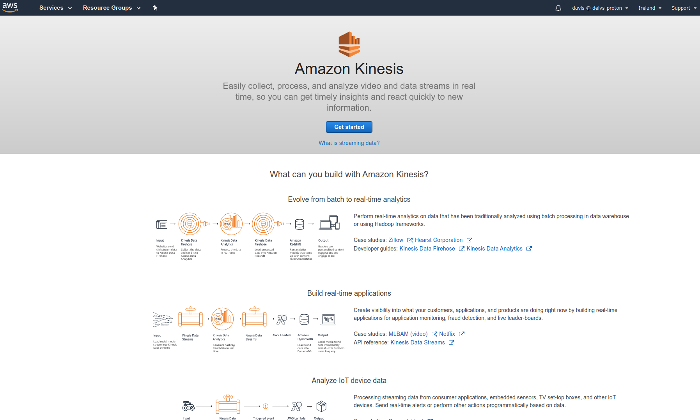
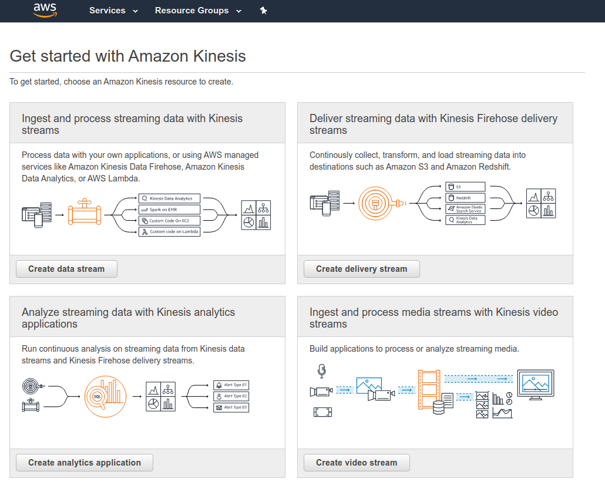

# Kinesis

- Kinesis is a managed alternative to Apache Kafka
- Great for allication logs, metrics, IoT, clickstreams
- Great for "real-time" big data
- Great for streaming processing frameworks (Spark, NiFi, etc...)
- Data is automatically replicated to 3 AZ

- Kinesis Streams: low latency streaming ingest at scale
- Kinesis Analytics: perform real-time analytics on streams using SQL
- Kinesis Firehose: load streams into S3, Redshift, ElasticSearch...

## Kinesis overview

- Streams are divided in ordered Shards / Partitions (like ordered queue)
- Data retention is 1 day by default, can go up to 7 days
- Ability to reprocess / replay data
- Multiple applications can consume the same stream
- Real-time processing with scale of throughput
- Once data inserted in Kinesis, it can't be deleted (immutability)

## Kinesis Streams Shards

- One steam is made of many different shards
- 1MB/s or 1000 messages/s at write PER SHARD
- 2MB/s at read PER SHARD
- Billing is per shard provisioned, can have as many shards as you want
- Batching available or per message calls
- The number of shards can evolve over time (reshard / merge)
- Records are ordered per shard

## AWS Kinesis API - Put records

- PutRecord API + Partition key that gets hashed
- Key is hashed to determine shard id
- The same key goes to the same partition (helps with ordering for a specific key)
- Messages sent get a "sequence number"
- Choose a partition key that is highly distributed (helps prevent "hot partition")
    - user_id if many users
    - Not country_id if 90% of the users are in one country
- Use batching with PutRecords to reduce costs and increase throughput
- ProvisionedThroughPutExceeded if we go over the limits
- Can use CLI, AWS SDK, or producer libraries from various frameworks

## AWS Kinesis API - Exceptions

- ProvisionedThroughputExceeded Exceptions
    - Happens when sending more data (exceeding MB/s or TPS for any shard)
    - Make sure you don't have a hot shard (such as your partition key is bad and too much data goes to that partition)
- Solution:
    - Retries with backoff
    - Increase shards (scaling)
    - Ensure your partition key is a good one

## AWS Kinesis API - Consumers

- Can use a normal consumer (CLI, SDK, etc)
- Can use Kinesis Client library (in Java, Node, Python, Ruby, .Net)
    - KCL uses DynamoDB to checkpoint offsets
    - KCL uses DynamoDB to track other workers and share the work amongst shards

## Hands on

Visit `Kinesis` from AWS Console.





Create a data stream.


Then you can work with it using the CLI.

```
$ aws kinesis help
$ aws kinesis list-streams help
$ aws kinesis list-streams
{
    "StreamNames": [
        "my-first-stream"
    ]
}
$ aws kinesis describe-stream help
$ aws kinesis describe-stream --stream-name my-first-stream
{...}
$ aws kinesis put-record --stream-name my-first-stream --data "user signup" --partition-key user_123
{
    "ShardId": "shardId-00000000000",
    "SequenceNumber": "4958877456415503463748463555080986096182857601881824546"
}
$ aws kinesis get-shard-iterator --stream-name my-first-stream --shard-id shardId-00000000000 --shard-iterator-type TRIM_HORIZON
{
    "ShardIterator": "..."
}
$ aws kinesis get-records help
$ aws kinesis get-records --shard-iterator "..." 
{
    "Records": [
        {
            "SequenceNumber": "4955877456415503463...",
            "AppriximateArrivalTImestamp": 1538394164.478,
            "Data": "dXNlciBzaWdudXa=", // base64 encoded
            "PartitionKey": "user_123"
        },
        ...
    ],
    "NextShardIterator": "AAA...",
    "MillisBehindLatest": 0
}
```

## Security

- Control access /authorization using IAM policies
- Encryption in flight using HTTP endpoints
- Encryption at rest using KMS
- Posibility to encrypt / decrypt data client side (harder)
- VPC endpoints available for kinesis to access within VPC

## Kinesis Data Analytics

- Perform real-time analytics on Kinesis Streams using SQL
- Kinesis Data Analytics
    - Auto Scaling
    - Managed: no servers to provision
    - Continous: real time
- Pay for actual consumption rate
- Can create streams out of the real-time queries

## Kinesis Firehose

- Fully managed service, no administration
- Near Real Time (60 seconds latency)
- Load data into Redshift / Amazon S3 / ElasticSearch / Splunk
- Automatic Scaling
- Support many data formats (pay for conversion)
- Pay for the amount of data going through Firehose 