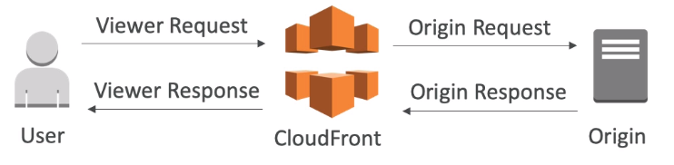

# AWS Lambda

## Why AWS Lamda

- EC2
    - Virtual Servers in the Cloud
    - Limited by RAM and CPU
    - Continuously running
    - Scaling means intervention to add / remove servers
- Lamda
    - Virtual functions - no servers to manage
    - Limited by time - short executions
    - Run on-demand
    - Scaling is automated

## Benefits of AWS Lamda

- Easy Pricing
    - Pay per request and compute time
    - Free tier of 1,000,000 AWS Lamda requests and 400,000 GBs of compute time
- Integrated with the whole AWS Stack
- Integrated with many programming languages
- Easy monitoring through AWS CloudWatch
- Easy to get more resources per functions (up to 3GB of RAM)
- Increasing RAM will also improve CPU and network

## Language support

- Node.js
- Python
- Java
- C# / .NET Core
- Golang
- C# / Powershell

## Integrations 

- Api Gateway
- Kinesis
- DynamoDB
- AWS S3
- AWS IoT
- CloudWatch Events
- CloudWatch Logs
- AWS SNS
- AWS Cognito
- Amazon SQS

## Example: Serverless Thumbnail creation

- New image in s3 
    - Trigger AWS Lamda & creates a thumbnail 
        - Push new thumbnail to s3
        - Push metadata to dynamodb

## Configuration

- Timeout: default 3 seconds, max 15 minutes
- Environment variables
- Allocated memory (127MB to 3GB)
- Ability to deploy within a VPC + assign security groups
- IAM execution role must be attached to the Lamda function

## AWS Lamda Limits

- Execution
    - Memory allocation: 128MB to 3008MB (64MB increments)
    - Maximum execution time: 15 minutes
    - Disk capacity in the "function container" (in /tmp): 512MB
    - Concurrency limits: 1000 (no of functions that can concurrently execute)
        - Can be increased by writing a support ticket.
- Deployment 
    - Lamda function deployment size (compressed .zip): 50MB
    - Size of uncompressed deployment (code + dependencies): 250 MB
    - Can use the /tmp directory to load other files at startup
    - Size of environment variables: 4KB

## Lamda@Edge

- You have deployed a CDN using CloudFront
- What if you wanted to run a global AWS Lamda alongside?
- Or how to implement request filtering before reaching your application?
- For this, you can use Lamda@Edge
    - Deploy lamda functions alongside your CloudFront CDN
        - Build more responsive applications
        - You don't manage servers, Lamda is deployed globally
        - Customize the CDN content
        - Pay only for what you use
- You can use Lamda to change CloudFront requests and responses
    - After CloudFront receives a request from a viewer (viewer request)
    - Before CloudFront forwards the request to the origin (origin request)
    - After CloudFront receives the response from the origin (origin response)
    - Before CloudFront forwards the response to the viewer (viewer response)
    - You can also generate responses to viewers without ever sending the request to the origin.

    

Use cases:
- Website Security and Privacy
- Dynamic Web Application at the Edge
- Search Engine Optimization (SEO)
- Intelligently Route Accross Origins and Data Centers
- Bot Mitigation at the Edge
- Real-time Image Transformation
- A/B Testing
- User Authentication and Authorization
- User Prioritization
- User Tracking and Analytics