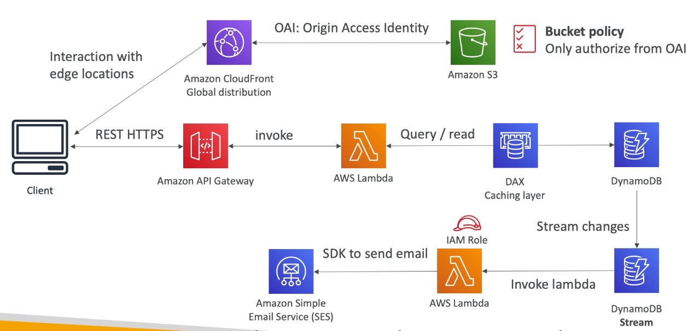
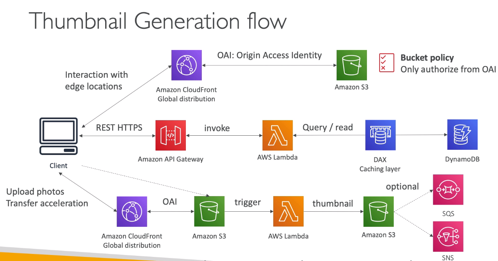

# Serverless hosted website: MyBlog.com

- This website should scale globally
- Blogs are rarely written, but often read
- Some of the website is purely static files, the rest is a dynamic REST API
- Caching must be implemented where possible
- Any new users that subscribe should receive a welcome email
- Any photo uploaded to the blog should have a thumbnail generated

