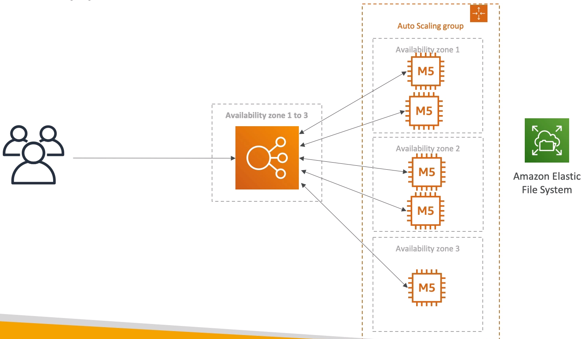
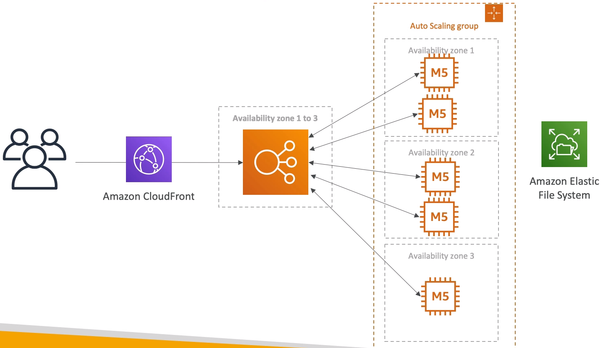

# Software updates offloading

- We have an application running on EC2 that distributes software updates once in a while
- When a new software update is out, we get a lot of requests and the content is distributed in mass over the network. It's very costly
- We don't want to change our application, but want to optimize our cost and CPU, how can we do it?

Current state:

Easy fix:

## Why cloudfront?

- No changes in architecture
- Will cache software update files at the edge
- Software update files are not dynamic, they're static (never changing)
- Our EC2 instances aren't serverless
- But CloudFront is, and will scale for us
- Our ASG will not scale as much, and we'll save tremendously in EC2
- We'll also save in availability, network bandwith cost etc

