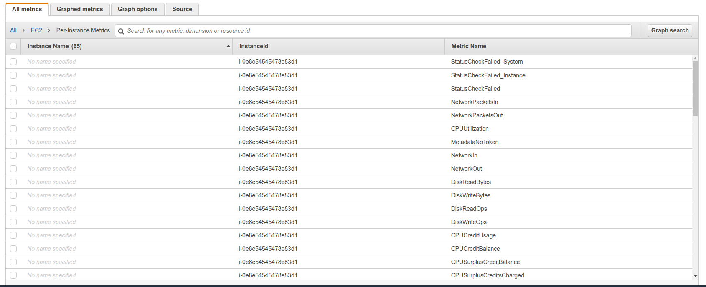

# AWS CloudWatch Metrics

- CloudWatch provides metrics for every service in AWS
- **Metric** is a variable to monitor (CPUUtilization, NetworkIn...)
- Metrics belong to **namespaces**
- **Dimension** is an attribute of a metric (instance id, environment, etc)
- Up to 10 dimensions per metric
- Metrics have **timestamps**
- Can create CloudWatch dashboards for metrics

## AWS CLoudWatch EC2 Detailed monitoring

- EC2 instance metrics have metrics "every 5 minutes"
- With defaulted monitoring (for a cost), you get data "every 1 minute"
- Use detailed monitoring if you want to more propt scale your ASG
- The AWS Free Tier allows us to have 10 defailed monitoring metrics
- Note: EC2 Memory usage is by default not pushed (must be pushed from inside the instance as a custom metric)

## AWS ClousWatch Custom metrics

- Possibility to define and send your own custom metrics to CloudWatch
- Ability to use dimensions (attributes) to segment metrics
    - Instance.id
    - Environment.name
- Metric resolution
    - Stanard: 1 minute
    - High Resolution: up to 1 second (storageResolution API parameter) - higher cost
- Use API call PutMetricData
- Use exponential back off in case of throttle errors

