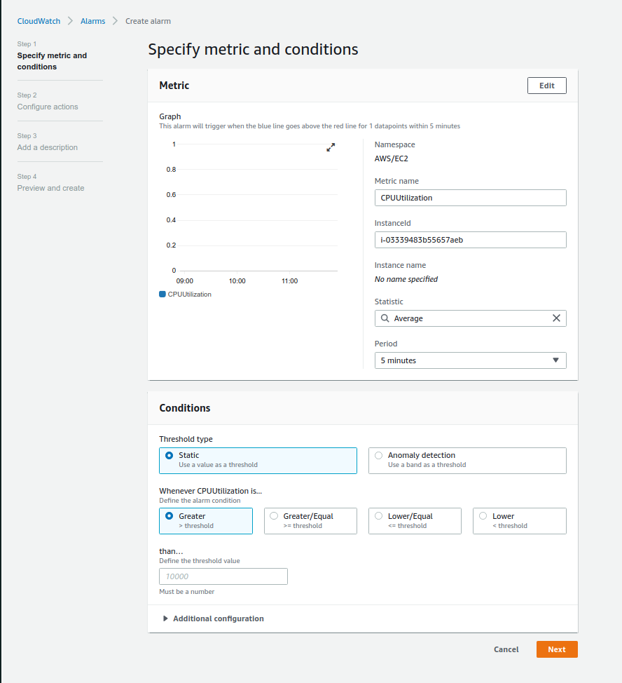

# CloudWatch Alarms

- Alarms are used to trigger notifications for any metric
- Alarms can go to Auto Scaling, EC2 actions, SNS notifications
- Various options (sampling, %, max, min, etc)
- Alarm States:
    - OK
    - INSUFFICIENT_DATA
    - ALARM
- Period:
    - Length of time in seconds to evaluate the metric
    - High resolution custom metrics: can only choose 10 sec or 30 sec

