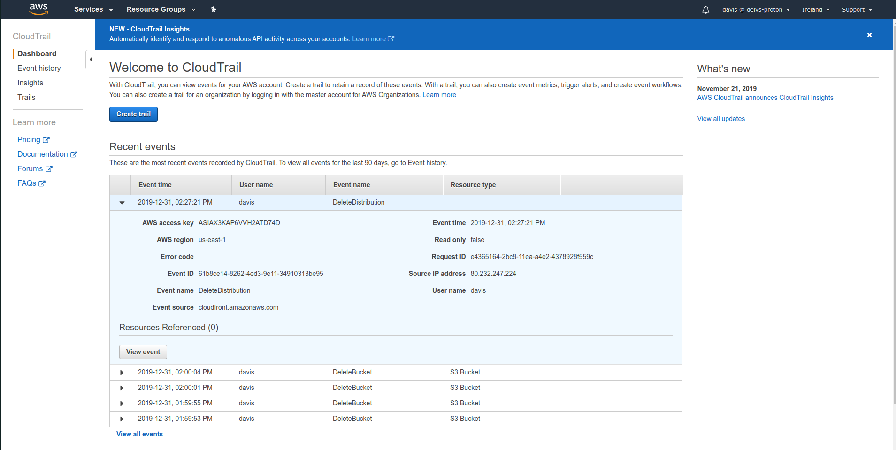
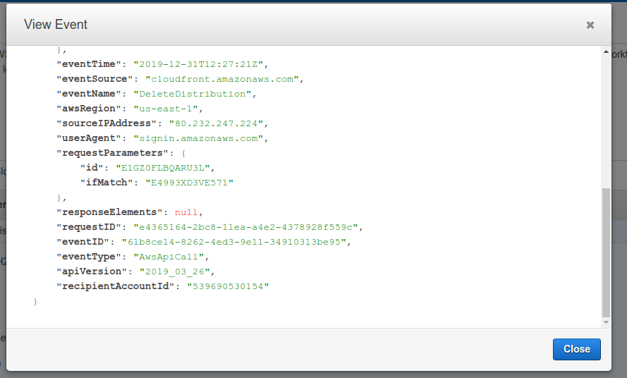

# AWS CloudTrail

- Provides governance, compliance and audit for your AWS account
- CloudTrail is enabled by default
- Get a history of events / API calls made within your AWS account by:
    - Console
    - SDK
    - CLI
    - AWS Services
- Can put logs from CloudTrail into CloudWatch Logs
- If a resource is deleted in AWS, look into CloudTrail first

