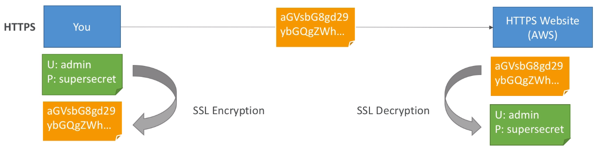
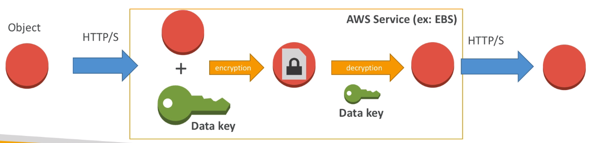
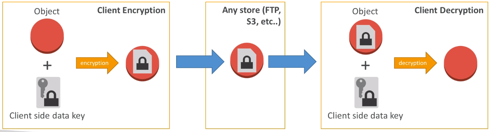

# Encryption 101

## Why Encryption?

### Encryption in flight (SSL)

- Data is encrypted before sending and decrypted after receiving
- SSL certificates help with encryption (HTTPS)
- Encryption in fligh ensures no MITM (man in the middle attack) can happen

### Server side encryption at rest

- Data is encrypted afer being received by the server
- Data is decrypted before being sent
- It is stored into an encrypted form thanks to a key (usually a data key)
- The encryption / decryption keys must be managed somewhere and the server must have access to it.

### Client side encryption

- Data is encrypted by the client and never decrypted by the server
- Data will be decrypted by a receiving client
- The server should not be able to decrypt the data
- Could leverage Envelope Encryption

