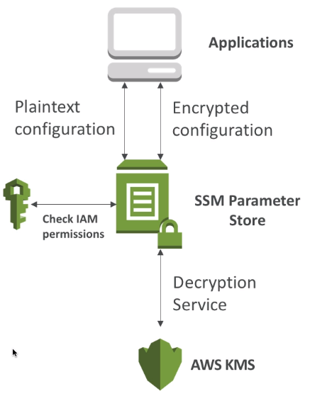

# SSM Parameter Store 

- Secure storage for configration and secrets
- Optional Seamless Encryption using KMS
- Serverless, scalable, durable, easy SDK, free
- Version tracking of configurations / secrets
- Configuration management using path & IAM
- Notifications with CloudWatch Events
- Integration with CloudFormation

## AWS Parameter Store Hierarchy

- /my-departments
    - my-app/
        - dev/
            - db-url
            - db-password
        - prod/
            - db-url
            - db-password
    - other-app/
- other-department

use with `GetParameters` or `GetParametersByPath` API in lamda functions.

