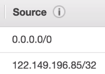

# Understanding CIDR - IPv4 (Classless Inter-Domain Routing)

- CIDR are used for Security Groups rules, or AWS networking in general

- They help to define an IP address range
    - We've seen WW.XX.YY.ZZ/32 == one IP
    - We've seen 0.0.0.0/0 == all IPs
    - But we can define 192.168.0.0/26: 192.168.0.0-192.168.0.63 (64 IPs)

## Understanding CIDR

- A CIDR has two components
    - The base IP (XX.XX.XX.XX)
    - The Subnet Mask (/26)
- The base IP represents an IP contained in the range
- The subnet masks defines how many bits can change in the IP
- The subnet mask can take two forms. Examples:
    - 255.255.255.0 (less common)
    - /24 (more common)

## Understanding CIDRs Subnet Masks

- The subnet masks basically allows part of the underlying IP to get additional next values from the base IP

- /32 allows for 1 IP = 2^0
- /31 allows for 2 IP = 2^1
- /30 allows for 4 IP = 2^2
- /29 allows for 8 IP = 2^3
- /28 allows for 16 IP = 2^4
- /27 allows for 32 IP = 2^5
- /26 allows for 64 IP = 2^6
- /25 allows for 128 IP = 2^7
- /24 allows for 256 IP = 2^8
- /16 allows for 65,536 IP = 2^16
- /0 allows for all IPs = 2^32

### Quick memo:
- /32 - no IP number can change
- /24 - last IP number can change
- /16 - last two IP numbers can change
- /8 - last three numbers can change
- /0 - all IP numbers can change

## Little excercise

- 192.168.0.0/24
    - 192.168.0.0 - 192.168.0.255 (256 IPs)
- 192.168.0.0/16
    - 192.168.0.0 - 192.168.255.255 (65.536 IPs)
- 134.56.78.123/32
    - Just 134.56.78.123/32
- 0.0.0.0/0
    - All IPs
- When in doubt, use this website: https://www.ipaddressguide.com/cidr

## Private vs Public IP (IPv4)

## Allowed ranges

- The internet Assigned Numbers Authority (IANA) established certain blocks of IPv4 addresses for the use of private (LAN) and public (internet) addresses.
- Private IP can only allow certain values
    - 10.0.0.0 - 10.255.255.255 (10.0.0.0/8) - in big networks
    - 172.16.0.0 - 172.31.255.255 (172.16.0.0/12) - default AWS one
    - 192.168.0.0-192.168.255.255 (192.168.0.0/16) - example: home networks
- All the rest of the IP one the internet are public IPs