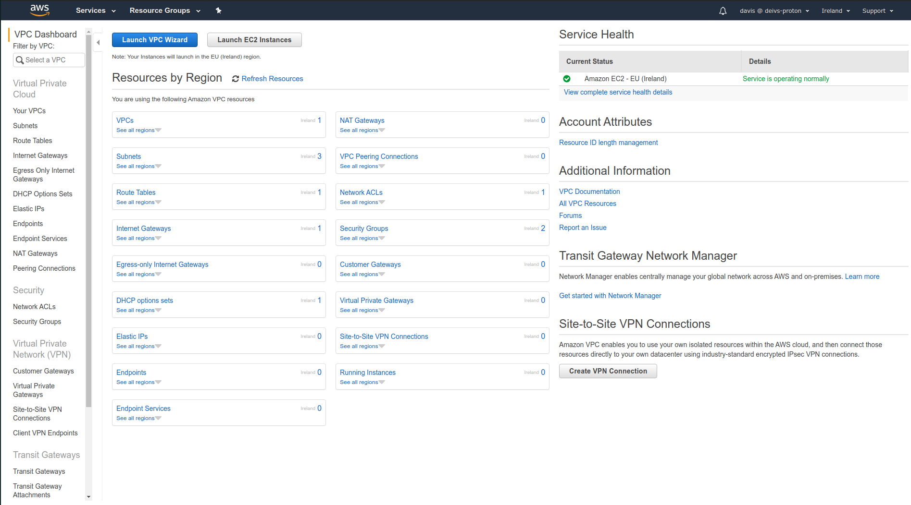
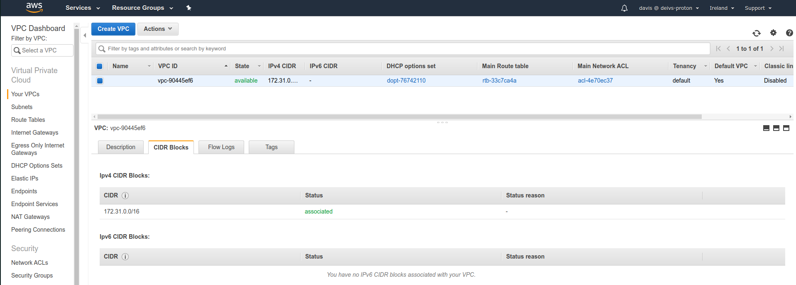
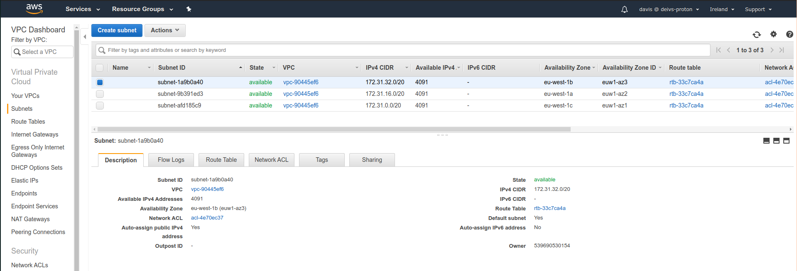
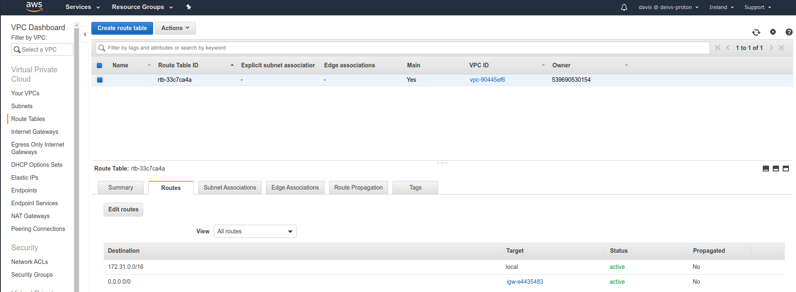
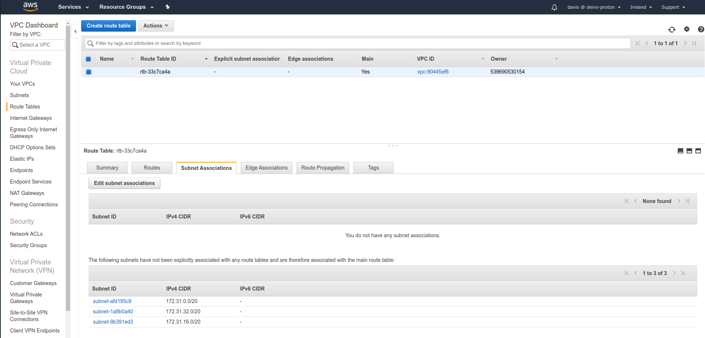
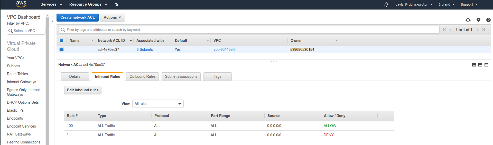
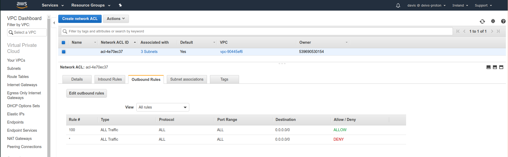

# Default VPC overview

- All new accounts have a default VPC
- New instances are launched into default VPC is no subnet is specified
- Default VPC have internet connectivity and all instances have public IP
- We also get a public and a private DNS name

Our account has one default VPC, available hosts - 65536.

Has 3 subnets - 3 availability zones, each has 4091 availabl IPs.

We have a VPC route table, which defines that one of the IPs has an internet gateway

and has associations to our 3 availability zone subnets

Then our 3 availability zones allow all inbound traffic and all outbound traffic (through network ACL):

