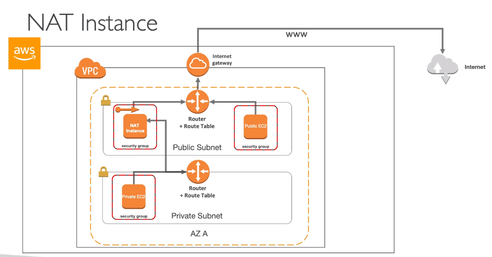
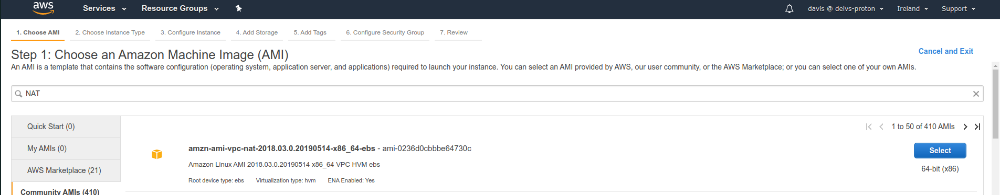
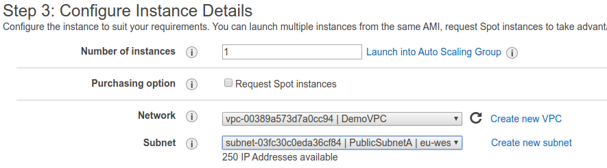
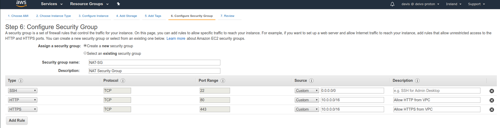
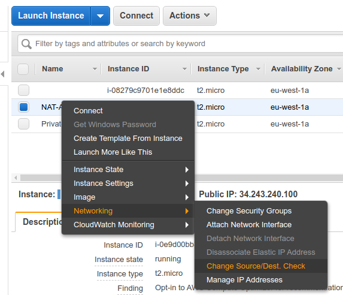
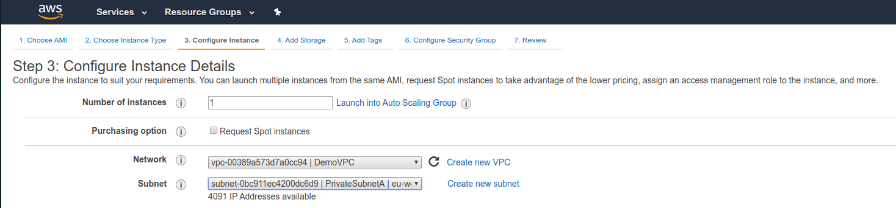
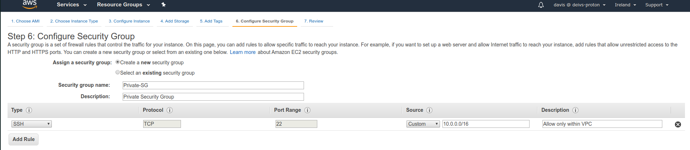

# NAT Instances - Network Address Translation (outdated)

- Allows instances in the private subnets to connect to the internet
- Must be launched in a public subnet
- Must disable EC2 flag: Source / Destination Check
- Must have Elastic IP attached to it
- Route table must be configured to route traffic from private subnets to NAT instance

To do this, we are going to add a new EC2 instance with a NAT template.

Place it in the public subnet

And we are going to launch a private instance in the private subnet.

Make sure to disable the Source/Dest check for the NAT.

Also would be recommended that the key pair is a different from the public ones.

Then edit the routes of the Private Instance and add the NAT instance.

By doing this, the private instance will have an access to the internet, through the NAT instance.

## NAT Instances - Comments

- Amazon Linux AMI-preconfigured are available
- Not highly available / resilient setup out of the box
- Would need to create ASG in multi AZ + resilient user-data script
- Internet traffic bandwidth depends on EC2 instance performance
- Must manage security groups & rules
    - Inbound
        - Allow HTTP / HTTPS traffic coming from private subnets
        - Allow SSH from your home network (access is provided though Internet Gateway)
    - Outbound
        - Allow HTTP / HTTPS traffic to the internet