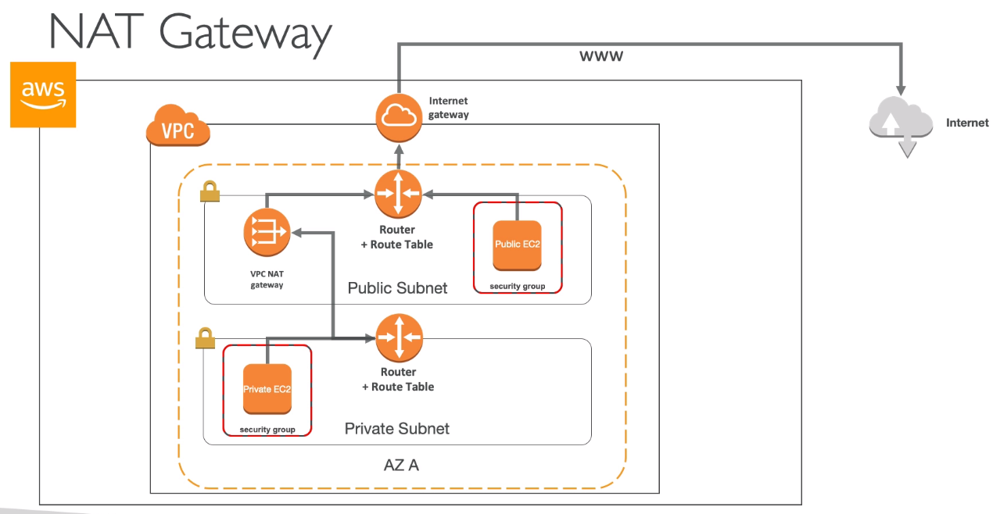
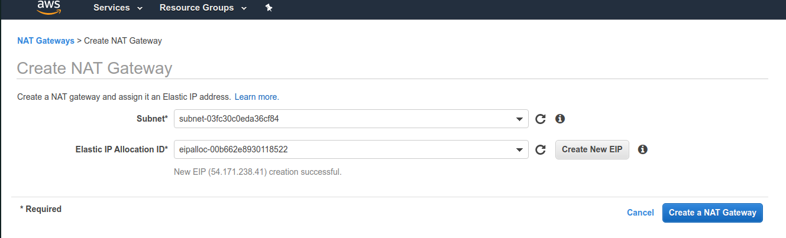
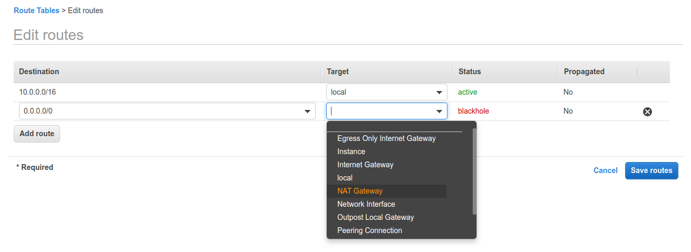
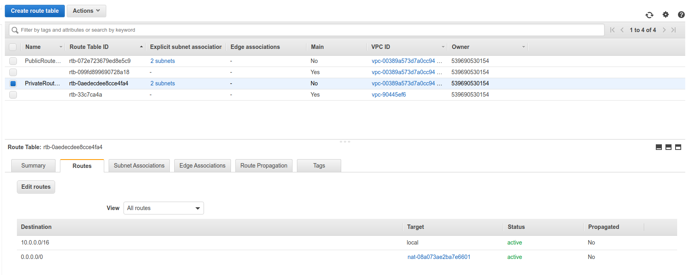

# NAT Gateways

- AWS Managed NAT, higher bandwidth, better availability, no admin
- Pay by the hour for usage and bandwidth
- NAT is created in a specific AZ, uses an EIP
- Cannot be used by an instance in that subnet (only from other subnets)
- Requires IGW (Private Subnet => NAT => IGW)
- 5 Gbps of bandwidth with automatic scaling up to 45 Gbps
- No security group to manage / required

The difference between NAT Gateway and NAT instance can be found here [https://docs.aws.amazon.com/vpc/latest/userguide/vpc-nat-comparison.html](https://docs.aws.amazon.com/vpc/latest/userguide/vpc-nat-comparison.html)

We are going to create a new NAT Gateway on `PublicSubnetA`

Then we are going to edit the route table of the `PrivateRouteTable`

