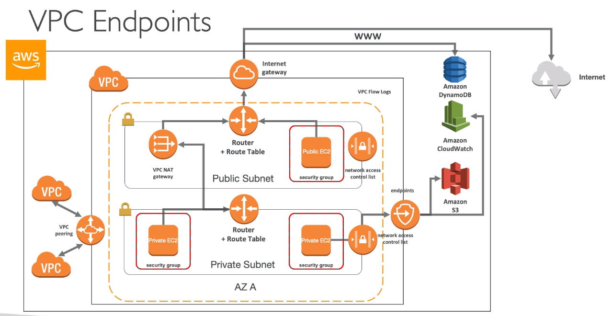
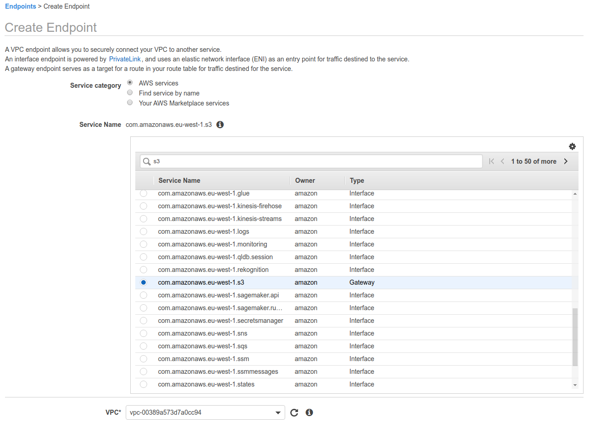
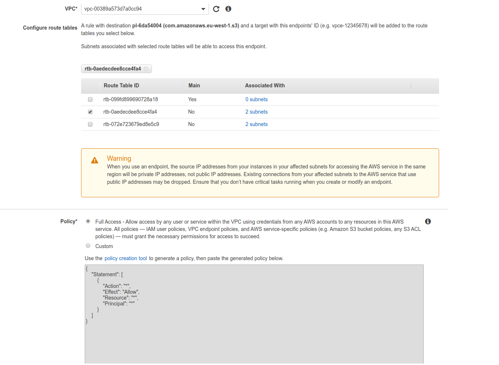
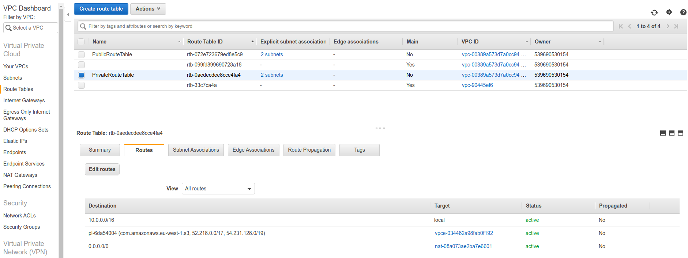

# VPC endpoints

- Endpoints allow you to connect to AWS Services using a private network instead of the public www network
- They scale horizontally and are redundant
- They remove the need of IGW, NAT, etc to access AWS Services
- Interface: provisions an ENI (private IP address) as an entry point (must attach security group) - most AWS servicess
- Gateway: provisions a target and must be used in a route table - S3 and DynamoDB
- In case of issues:
    - Check DNS Setting Resolution in your VPC
    - Check Route Tables

Now the Private Subnet should have access to S3 without any internet access (if we remove that Gateway), provided the EC2 instance has the correct IAM permissions.

