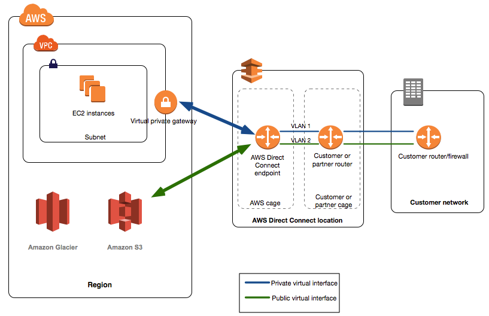

# Direct Connect & Direct Connect Gateway

- Provides a dedicated private connection from a remote network to your VPC
- Dedicated connection must be setup between your DC and AWS Direct Connect locations
- You need to setup a Virtual Private Gateway on your VPC
- Access public resources (S3) and private (EC2) on same connection
- Use cases:
    - Increase bandwidth thoughput - working with large data sets - lower cost
    - More consistent network experience - applications using real-time data feeds
    - Hybrid environments (on prem + cloud)
- Supports both IPv4 and IPv6

## Direct Connect Gateway

- If you want to setup a Direct Connect to one or more VPC in many different regions (same account), you must use a Direct Connect Gateway
- https://docs.aws.amazon.com/directconnect/latest/UserGuide/direct-connect-gateways.html