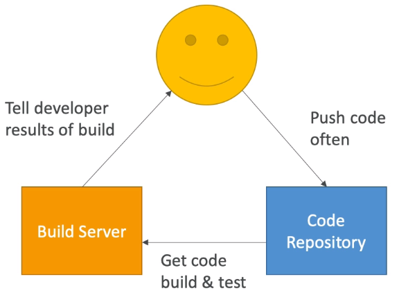
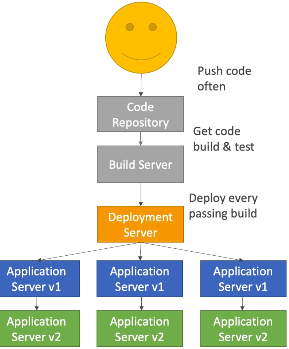
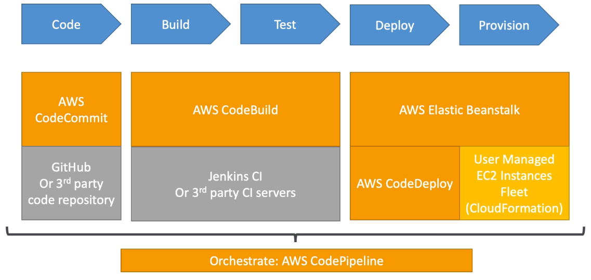

# Continuous Integration

- Developers push the code to a code repository often (Github / CodeCommiut / Bitbucket / etc)
- A testing / build server checks the code as soon as it's pushed (CodeBuild / Jenkins CI / etc)
- The developer gets feedback about the tests and checks that have passed / failed
- Find bugs early, fix bugs
- Deliver faster as the code is tested
- Deploy often
- Happier developers as they're unblocked

---

- Ensure that the software can be released reliably whenever needed
- Ensures deployments happen often and are quick
- Shift away from "on release every 3 months" to "5 releases a day"
- That usually means automated deployment
    - CodeDeploy
    - Jekins CD
    - Spinnaker
    - Etc

## Technology Stack for CICD

