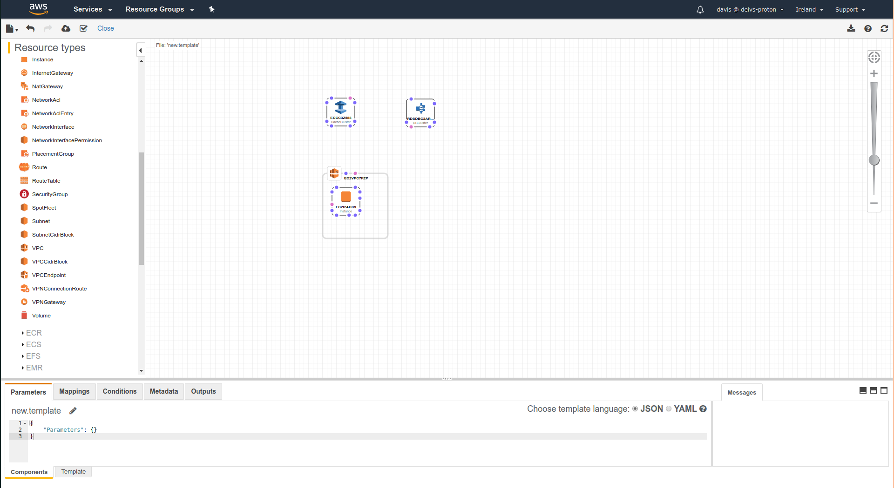

# CloudFormation

## Infrastructure as Code

- Current we have been doing a lot of manual work
- All this manual work will be very tough to repproduce
    - In a nother region
    - In another AWS account
    - Within the same region if everyhthing was deleted
- Wouldn't it be great if all our infrastructure was code?
- That code would be deployed and create/update/delete our infrastructure

## What is CloudFormation

- CloudFormation is a declaritive way of outlining your AWS Infrastructure, for any  resources (most of them are supported).
- For example, within a CloudFormation template, you say:
    - I want a security group
    - I want two EC2 machines using this security group
    - I want two Elastic IPs for these EC2 machines
    - I want an S3 bucket
    - I want a load balancer ELB in front of these machines
- Then CloudFormation creates those for you, in the right order, with the exact configuration you specify.

## Benefits of AWS CloudFormation

- Infrastructure as code
    - No resources are manually created, which is excellent for control
    - The code can be version controlled for example, using git
    - Changes to the infrastructure are reviewed through code
- Cost
    - Each resources within the stack are tagged with an identifier so you can easily see how much stack costs you
    - You can estimate the costs of your resources using the CloudFormation template
    - Savings strategy: in dev, you could make automation that deletes templates at 5pm and recreates them at 8am safely.
- Productivity
    - Ability to destroy and re-create an infrastructure on the cloud on the fly
    - Automated generation of Diagram for your templates
    - Declaritive programming (no need to figure out ordering and orchestration)
- Separation of concern - create many stacks for many apps, and many layers
    - VPC stacks
    - Network stacks
    - Apps stacks
- Don't re-invent the wheel
    - Leverage existing templates on the web!
    - Leverage documentation

## How CloudFormation works

- Templatess have to be uploaded in S3 and then referenced in CloudFormation
- To update a template, we can't edit previous ones. We have to re-upload a new version of the template to AWS
- Stacks are identified by a name
- Deleting a stack deletes every single artifact was created by CloudFormation

## Deploying CloudFormation templates

- Manual way:
    - Editing templates in the CloudFormation Designer
    - Using the console to input parameters, etc
- Automated way
    - Editing templates in a YAML file
    - Using the AWS CLI to deploy the templates

## Templates components
    
- Resources components
    - Resources: your AWS resources declared in the template (mandatory)
    - Parameters: the dynamic inputs for your template
    - Mappings: the static variables for your template
    - Outputs: References to what has been created
    - Conditionals: List of conditions to perform resource creation
    - Metadata
- Templates helpers
    - References
    - Functions

## Hands On

When creating a new stack, you can choose between 3 options:
- Upload your template
- Use a sample template
- Design your template in a GUI way

