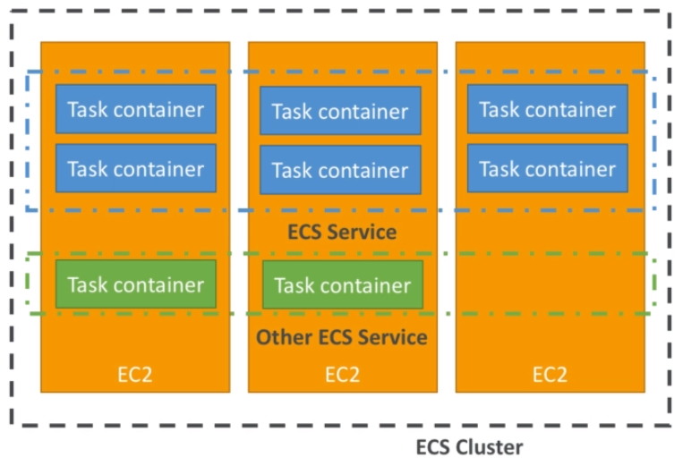
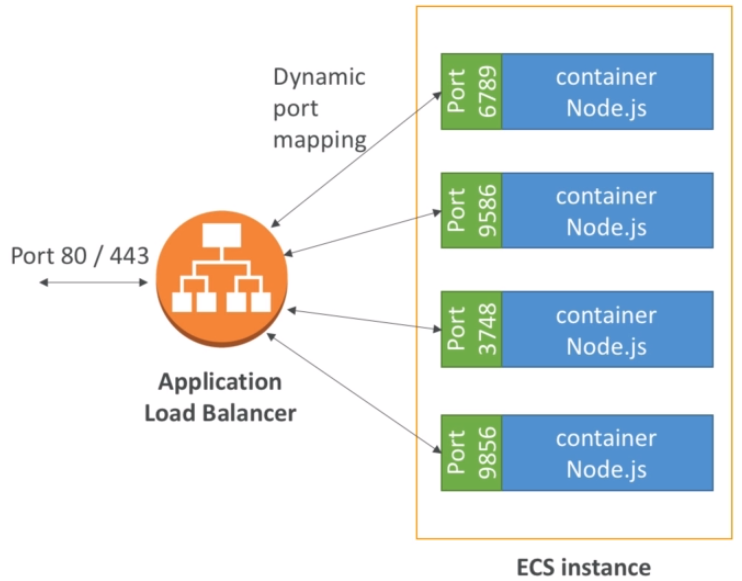
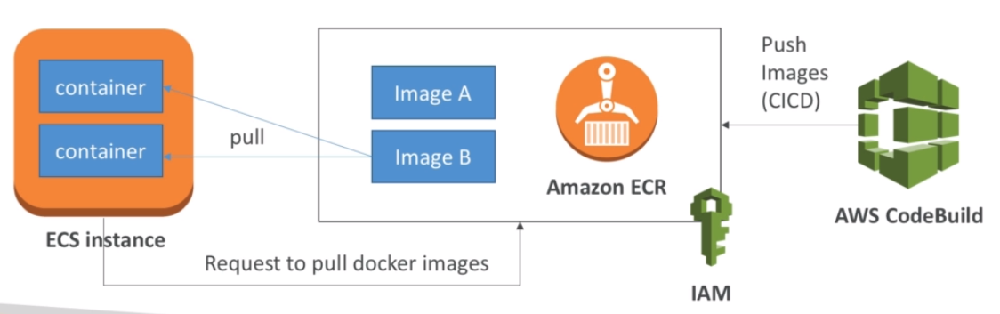

# ECS - Elastic Container Service

- ECS is a container orchestration service
- ECS helps you run Docker containers on EC2 machines
- ECS is complicated and made of:
    - "ECS Core" : Running ECS on user-provisioned EC2 instances
    - Fargate: Running ECS tasks on AWS-provisioned compute (serverless)
    - EKS: Running ECS on AWS-powered Kubernetes (running on EC2)
    - ECR: Docker Container Registry hosted by AWS
- ECS & Docker are very popular for microservices
- IAM security and roles at the ECS task level

## What's docker?

- Docker is a container technology
- Run a containerized application on any machine with Docker installed
- Containers allows our application to work the same way anywhere
- Containers are isolated from each other
- Control how much memory / CPU is allocated to your container
- Ability to restrict network rules
- More fficient than Virtual Machines
- Scale containers up and down very quickly (seconds)

## ECS - Use cases

- Run microservices
    - Ability to run multiple docker containers on the same machine
    - Ease service discovery features to enhance communication
    - Direct integration with Application Load Balancers
    - Auto scaling capability
- Run batch processing / scheduled tasks
    - Schedule ECS containers to run On-demand / Reserved / Spot instances
- Migrate applications to the cloud
    - Dockerize legacy applications running on premise
    - Move docker containers to run on ECS

## AWS ECS - Concepts

- ECS cluster: set of EC2 instances
- ECS service: applications definitions running on ECS cluster
- ECS tasks + definition: containers running to create the application
- ECS IAM roles: roles assigned to tasks to interact with AWS



## AWS ECS - ALB Integration

- Application Load Balancer (ALB) has a direct integration feature with ECS called "port mapping"
- This allows you to run multiple instances of the same application on the same EC2 machine
- Use cases
    - Increased resiliency even if running on one EC2 instance
    - Maximize utilization of CPU / cores
    - Ability to perform rolling upgrades without impacting application uptime



## AWS ECS - ECS Setup & Config file

- Run an EC2 instance, install the ECS agent with ECS config file
- Or use the ECS-ready Linux AMI (still need to modify the config file)

- ECS Config file is at `/etc/ecs/ecs.config`

```conf
ECS_CLUSTER=MyCluster # Assign EC2 instance to an ECS cluster
ECS_ENGINE_AUTH_DATA={...} # to pull images from private registries
ECS_AVAILABLE_LOGGING_DRIVERS=[...] # CloudWatch container logging
ECS_ENABLE_TASK_IAM_ROLE=true # Enable IAM roles for ECS tasks
```

## AWS ECR - Elastic Container Registry

- Store, managed and deploy your containers on AWS
- Fully integrated with IAM & ECS
- Sent over HTTPS (encryption in flight) and encrypted at rest

