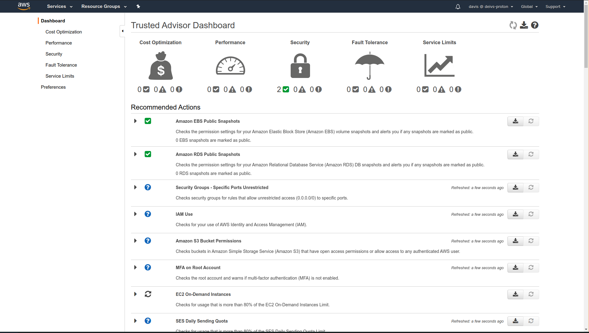
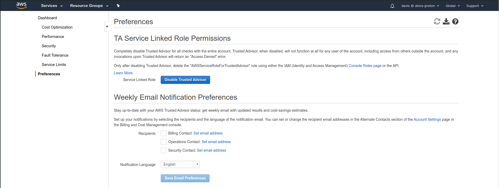

# Trusted Advisor

- No need to install anything - high level AWS account assesment
- Analyze your AWS accounts and provides recommendations
    - Cost Optimization
    - Performance
    - Security
    - Fault Tolerance
    - Service Limits
- Core Checks and recommendations - all customers
- Can enable weekly email notification from the console
- Full Trusted Advisor - Available for Business & Enterprise support plans
    - Ability to set CloudWatch alarm when reaching limits

