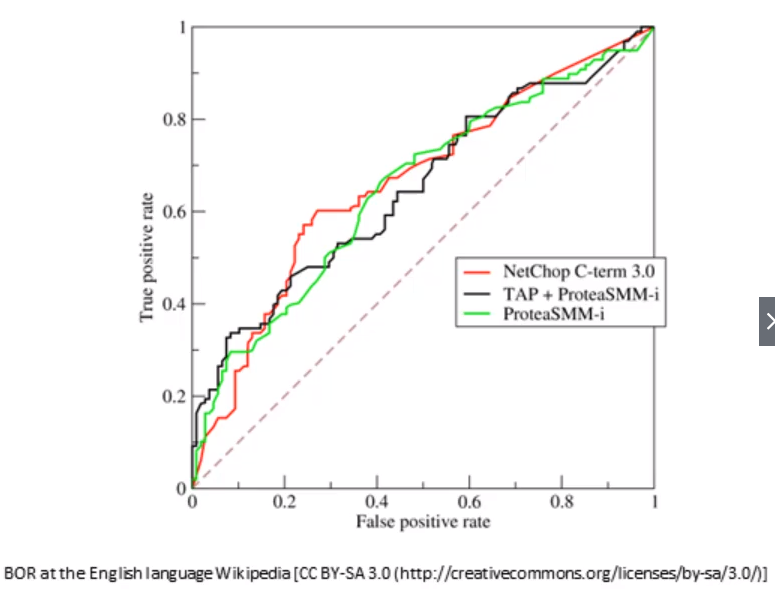

# Measuring Classifiers (Precision, Recall, F1, ROC, AUC)

## Recall

$$ \frac{true positives}{true positives+false negatives}$$

- Aka sensitivity, true positive rate, completeness
- Percent of positives correctly predicted
- Good choice of metric when you care a lot about false negatives
    - i.e. fraud detection

|                     | Actual fraud | Actual not fraud |
|---------------------|--------------|------------------|
| Predicted fraud     | 5            | 20               |
| Predicted not fraud | 10           | 100              |

$$ Recall = \frac{TP}{TP+FN} = \frac{5}{5+10} = \frac{1}{3} = 33\% $$

## Precision

$$ \frac{true positives}{true positives + false positives} $$

- Aka correct positives
- Percent of relevant results
- Good choice of metric when you care a lot about false positives
    - i.e., medical screening, drug testing

## Other metrics

- Specificity $\frac{TN}{TN+FP} = true negative rate$
- F1 score
    - $\frac{2TP}{2TP+FP+FN}$
    - $2 * \frac{precision*recall}{precision+recall}$
    - Harmonic mean of precision and sensitivity
    - When you care about precision and recall
- RMSE
    - Root mean squared error
    - Accuracy measurement
    - Only cares about right & wrong answers

## ROC Curve

- Receiver Operating Characteristic Curve
- Plot of true positive rate (recall) vs false positive rate at various threshold settings.
- Points above the diagonal represent good classigication (better than random)
- Ideal curve would just be a point in the upper left corner
- The more i's bent toward the upper left the better.

## AUC

- The are under the ROC curve
- Equal to probability that a classifier will rank a randomly chosen positive instance higher than a randomly chosen negative one
- ROC AUC of 0.5 is a useless classifier, 1.0 is perfect.
- Commonly used metric for comparing classifiers.
