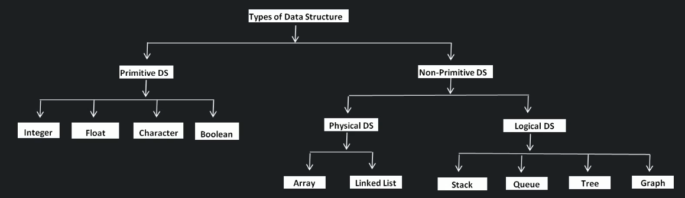

# Types of DS

On the high level Data Structures can be divided in two categories - Primitive DS and Non-Primitive DS.
Primitive DS are provided by given programming language - integer, float, character, boolean.
Non-primitive categories can be divided into another two categories - physical DS (Array, LinkedList) and Logical DS (Stack, Queue, Tree, Graph).

