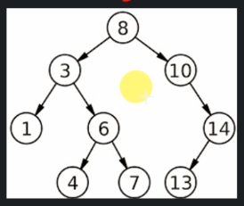

# What is recursion?

When it comes to recursion, there are 3 basic properties:
- Same operation is performed multiple times with different inputs
- In every step we try to make the problem smaller
- We mandatorily need to have a base condition, which tells system when to stop the recursion.

The recursion can be applied to this binary search tree, when searching for value `4`.



```
search(root, valueToSearch)
    
    if(root == null) return null
    else if (root.value == valueToSearch) return root
    else if (valueToSearch < root.value) search(root.left, valueToSearch)
    else search(root.right, valueToSearch)

```

