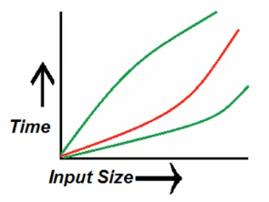
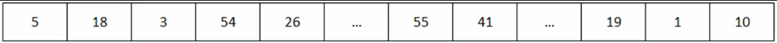

# Notations for Algorithm runtime analysis

There are 3 notations for runtime analysis:
- Omega (Ω):
    - This notation gives the tighter lower bound of a given algorithm
    - In laymans terms - we can say that for any given input, running time of a given algorithm will not be `less than` given time.
- Bog-o (O)
    - This notation gives the tighter upper bound of a given algorithm
    - For any given input, running time of a given algorithm will not be `more than` given time.
- Theta (Θ)
    - This notation decides whether upper bound and lower bound of a given algorithm are the same of not.
    - For any given input, running time of a given algorithm will `on average` be equal to given time.

## Examples for notations

We can try to understand these 3 notations with a simple array example.
It is not a sorted one. Our task is to find a given number in the array.

We have to start at the first cell and check if it matches the given number, if it does - return the cell index. If not, repeat the process on the next cell until we have found the number. If we reach the end of the array and still don't find the number - return an error message.

So in total, we have `n` number of cells. To check all the cells, it will take `n * 1 = n` units of time. 

- Omega (Ω):
    - Ω(1)
- Bog-o (O)
    - O(n)
- Theta (Θ)
    - Θ(n/2)

Most of the time we will only be concerned about Big-O notations, but others are still used in academic work.