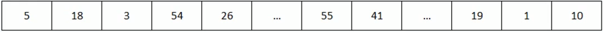

# Finding Time Complexity of an iterative algorithm

We have a 1D array of unsorted values:



```
findBiggestNumber( int arr[] ):
    biggestNumber = arr[0]
    loop: i = 1 to length(arr) - 1
        if arr[i] > biggestNumber
            biggestNumber = arr[i]
    return biggestNumber
```

```
findBiggestNumber( int arr[] ):
    biggestNumber = arr[0] ------------------ O(1)
    loop: i = 1 to length(arr) - 1 ---------- O(n)
        if arr[i] > biggestNumber ----------- O(1)
            biggestNumber = arr[i] ---------- O(1)
    return biggestNumber -------------------- O(1)

Time complexity = O(1) + O(n) + O(1) = O(n)
```

When calculating time complexity, we are avoiding constant values, so we do not take in to account them.

Same will be in cases like these:

```
O(n-1) = O(n)
O(2n) = O(n)
O(10) = O(1)
O(2000) = O(1)
```


