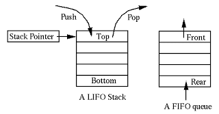

# What is a queue and why use it

A queue is similar to stack, but when adding new elements to it, it adds them to the end. When removing and element, we will remove the first element from the queue. This is called a FIFO method - first in, first out.

(image taken from http://pakitgroup.blogspot.com/p/data-structure.html)

## When should we use queues?

When we need to create an application which utilizes `first incoming data gets processed first (FIFO)` priciples.

Examples:
- A reception counter

## When to avoid queues?

When we might need random access to other values other than the first one. Correcting mistakes will be painful.

## Common operations in queues

- Create queue
- enQueue - insert data in queue
- deQueue - extract data from queue
- peekInQueue - get an element from queue
- isEmpty - check if queue is empty
- isFull - check if queue is full
- deleteQueue - delete the queue

## Implementation options of queue

A queue can be implemented both in array and linked list. In array we can implement two types of queues - linear queue and circular queue. In linked lists - we can only implement linear queues.