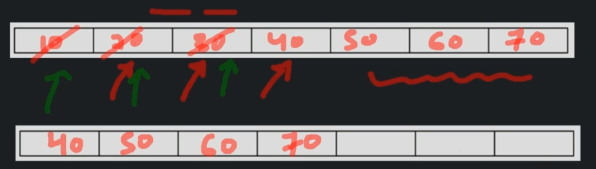
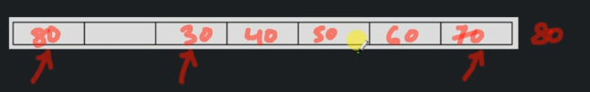

# Circular queues

There is a small problem with the linear queues, so a circular queue was created. 

The problem arises when using `deQueue` method leaves a blank cell when it extracts an element, which then becomes unused. When we have a limited space, this is not an optimal usage of the space.

The fix for that is to move all the elements to the start of the array, after executing the `deQueue`.



The tradeoff is that when we start moving the elements to the start of the array, the time complexity moves from `O(1)` to `O(n)`.

To manage this in O(1) time complexity, we can use circular queues, which basically checks, whenever we want to add an element to the queue, and we are already at the end, if there are any elements at the start that are empty and add them there.




```
createQueue(size)
    create a blank array of `size`
    initialize topOfQueue, beginingOfQueue to -1

Time complexity O(1)
Space complexity O(n)
```

```
enQueue(value)
    if queue is full
        return error
    else if topOfQueue+1 == size
        // top at the last cell of array, reset it to first cell
        topOfQueue = 0
    else
        topOfQueue++
    arr[topOfQueue] = value

Time complexity O(1)
Space complexity O(1)
```

```
deQueue()
    if queue is empty
        return error
    print arr[beginningOfQueue]

    if start == topOfQueue // only 1 element
        start = topOfQueue = -1
    else if start + 1 == size // start has reached end of array
        start = 0
    else
        start ++
    
Time complexity - O(1)
Space complexity - O(1)
```

```
peek()
    if queue empty
        return error
    print arr[beginningOfQueue]

Time complexity - O(1)
Space complexity - O(1)
```

```
isQueueEmpty()
    if topOfQueue == -1
        return true
    return false

Time complexity - O(1)
Space complexity - O(1)
```

```
isQueueFull()
    if topOfQueue + 1 == start // completed a circle, queue is full
        return true
    else if start == 0 && topOfQueue == size
        return true
    return false

Time complexity - O(1)
Space complexity - O(1)
```

```
deleteQueue()
    array = null
```

## Time and space complexity of lineart queue

|              | Time complexity | Space complexity |
|--------------|-----------------|------------------|
| create queue | O(1)            | O(n)             |
| enqueue      | O(1)            | O(1)             |
| dequeue      | O(1)            | O(1)             |
| peek         | O(1)            | O(1)             |
| isEmpty      | O(1)            | O(1)             |
| isFull       | O(1)            | O(1)             |
| delete queue | O(1)            | O(1)             |