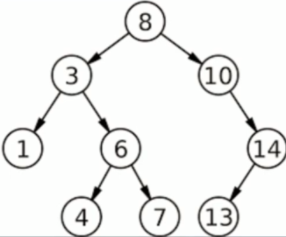

# What is a binary search tree

A binary search tree is basically a binary tree that follows additional rules:
- The left sub-tree of a node has a key less tan or equal to it's parent node's key.
- The right sub-tree of a node has a key greater to it's parent node's key.

Example:

## Common operations of BST

- Creation of BST
- Searching for a value
- Traversal of all nodes
- Insertion of a node
- Deletion of a node
- Deletion of BST