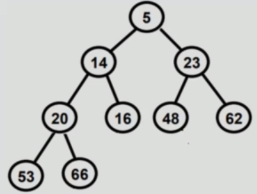
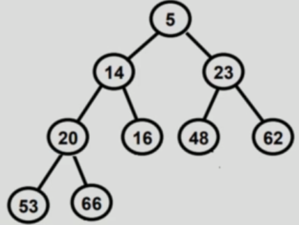
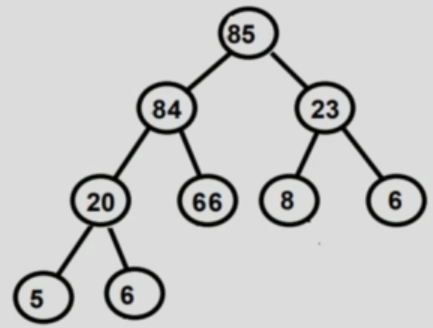

# What is a binary heap

Binary heap is a binary tree, but with some special properties:
- Heap property:
    - value of any given node must be <= value of it's children (min-heap property)
    - value of any given node must be >= value of it's children (max heap)
- Complete tree
    - All levels are completely filled except possibly the last level and the last level has all keys as left as possible.
    - This makes binary heap ideal candidate for array implementation.

## Why learn Binary Heap?

There are cases when we want to find `min/max` number along set of numbers in `log(n)` time. Also, we want to make sure that inserting additional numbers does not take more than `O(log n)` time.

Possible solutions:
    1. Store numbers in a sorted array. But, when we are going to insert a new number, it will take O(n) time to do that.
    2. Store the numbers in a linked list, in a sorted manner, but it will also take O(n) time.

## Types of binary heap

There are 2 types of binary heap:

- Min heap - if the value of each node is less than or equal to value of both it's children

- Max heap - if the value of each node is more than or equal to value of both it's children

## Common operations

- Create Heap - creates a blank Array to be used for storing heap
- Peek top of heap - returns min/max from heap
- Extract min/max - extracts min/max from heap, we can extract only this node.
- Size of heap - returns size of the heap
- insert value in heap - insert value in heap
- delete heap - deletes the entire heap
