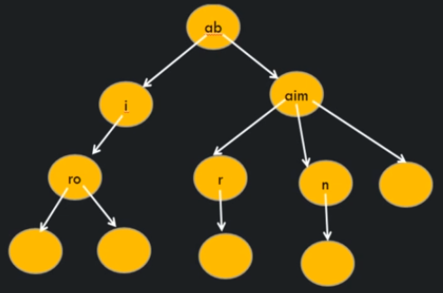

# What is a Trie?

- It is a search tree which is typically used to store/search strings in space/time efficient way.
- In it, any node can store non repetitive multiple characters
- Also, every node stores link of next character of the string.
- Also, every node keeps a track of `end of string`.

## Common usages

- Spelling checker
- Auto complete string
- etc

## Common operations

- Creating a Trie
- Inserting a String in Trie
- Searching a String in Trie
- Deleting a String from Trie

