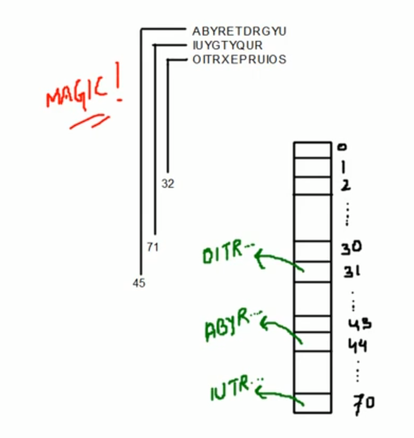

# What is Hashing

- Hashing is a method of sorting and indexing data. The idea behind hashing is to allow large amounts of data to be indexed using keys commonly created by formulas.



## Who do we need Hashing?

It's time efficient:

| Data structures | Time complexity for search operation |
|-----------------|--------------------------------------|
| Array           | O(log n)                             |
| Linked List     | O(n)                                 |
| Tree            | O(log n)                             |
| Hashing         | O(1) best case / O(n) worst case                          |

## Some terminologies

- Hash function - a hash function is any function that can be used to map data of arbitrary size to data of fixed size.
- Key - input data given by user
- Hash value - the values returned by a hash function are called hash values, hash codes, digests, or simply hashes.
- Hash table - it is a data structure which implements an associative array abstract data type, a structure that can map keys to values.
- Collision - a collision occurs when to different keys produce the same output as the hash value.

## Characteristics of a good Hash function

- It distributes hash values uniformly accross the hash table
- The hash function uses all the input data

## Types of collision resulution techniques

There are two types of collision resolution techniques:

- Direct Chaining

    Our hash table is not an array of hash table, it is an array of references as a linked list.

    When we add a value in the hash table, we add a reference to it's node.

    When there is another node that should go in the same index of the hash table, we update the `next` reference in the previously added node to the new node.

- Open addressing

    - Linear probling

        We compute a hash function and see that the index in the hash table is already taken. We go to the next index and see if it's open.

    - Quadratic probing

        In case of quadratic probing, every time we have a collision, we add the collision number squared.

        ```
            First time x + 1^2
            Second time x + 2^2
            ...
        ```

    - Double hashing

        We have 2 hash functions - one primary, one secondary. We use the primary hash function, whenever a collision is detected, we calculate the secondary hash value and add it to the primary hash value. The result is used as the hash table index.

        If the collision is still there, we multiply the secondary hash value with the collision number and add it to the primary hash value.

        ```
            PrimaryHashFunction + (1 * secondaryHashFunction())
            PrimaryHashFunction + (2 * secondaryHashFunction())
            PrimaryHashFunction + (3 * secondaryHashFunction())
            ...
        ```

## What happens when the hash table is full?

- Direct chaining:
    - Situation will never arise
- Open addressing:
    - Need to create 2x size of current hash table and redo hashing for existing keys.

## Pros & Cons of collision resolution techniques

- Direct chaining
    - No fear of exhausting hash table buckets
    - Fear of big linked lists (can effect performance big time)
- Open addressing
    - Easy implementation
    - Fear of exhausting hash table buckets
- If input size is known then always use "open addressing", else can use any of two.
- If deletion is very high, we should always go with direct chaining.

## Practical uses of hashing

- Password verification
- File systems - mapping files to a physical location on disk

## Pros & Cons of hashing

Pros:
- On an average insertion/deletion/search operation takes O(1) time

Cons:
- In the worst case insertion/deletion/search might take O(n) time (when hash functions are not good enough).

