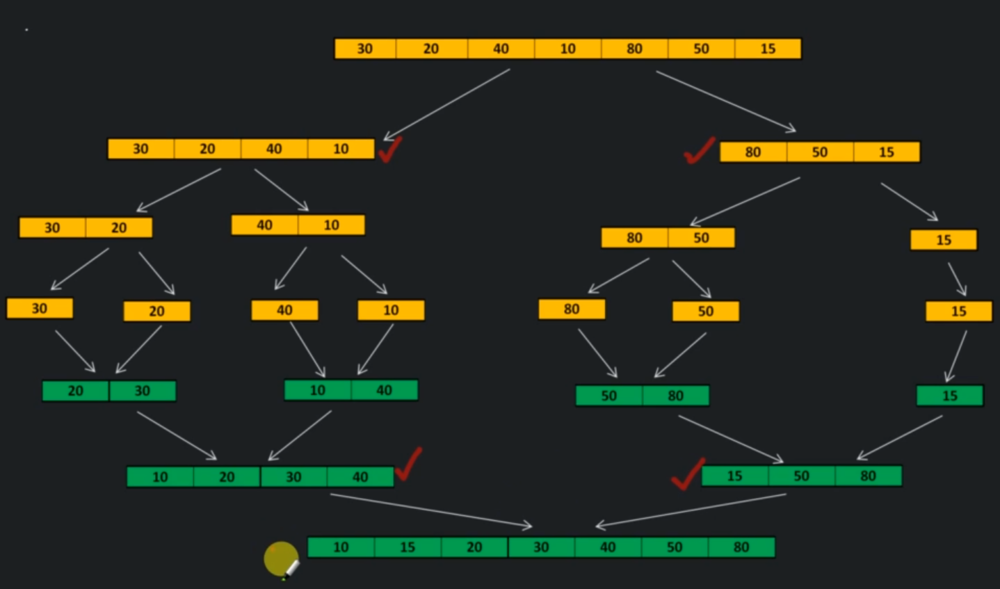

# Merge sort

Merge sort is basically a divide and conquer algorithm.
It divides inpout array into two haves, keep breaking those 2 halves recursively, until they become too small to be broken further.

Then each of the broken pieces are merged together into the final answer.



```
mergeSort(A,l,r)
    if r > l
        middle m = (l+r)/2
        mergeSort(A,l, m)
        mergeSort(A,l+1, r)
        merge(A, l, m, r)

merge(A, p, m, r):

    create tmp arrays L & R and copy A, p, m into L & A, M+1 r, into R.

    i=j=0
    loop: k = p to r
        if L[i] < R[j]
            A[k] = L[i]; i++
        else
            A[k] = R[j]; j++

Time complexity - O(n log n)
Space complexity - O(n)
```

## When to use
- When tou need a stable sort
- When Average expected time is O(n log n)

## When to avoid
- When space is a concern like embedded systems