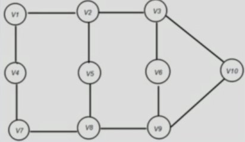

# What is a graph

A graph is a pair of sets (V, E) where V is the set of vertices and E is the set of Edgets, connecting the pairs of vertices.



```
V = {v1, v2, v3, v4, v5,v6, v7, v8, v9, v10}
E = {v1v2, v2v3, v1v4, v4v7, v7v8, v2v5, v5v8, v3v6, v6v9, v8v9, v3v10, v9v10}
```

One of the use cases of graphs can be that we can use graphs to find shortest paths between points in the graph.

## Terminologies

- Vertices - nodes of the graph
- Edges - the arcs that connect pairs of vertices
- Unweighted graph - a graph not having a weight associated with any edge
- Weighted graph - graph having weight associated to each edge
- Undirected graph - graph that is set of vertices connected by edgets, where the edges don't have a direction associated with them.
- Directed graph - the edges have direction associated with them
- Cyclic graph - a graph having at least one loop
- Acyclic graph - without any loops
- Tree - A special case of directed acyclick graph (DAG)

## Types of graphs

- Directed
    - Weighted
        - Positive
        - Negative
    - Unweighted
- Undirected
    - Weighted
        - Positive
        - Negative
    - Unweighted