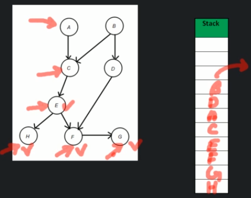

# Topological Sort

Topological Sort sorts given actions in such way that if there is a dependency of one action on another,then the dependent action always comes later that it's parent action.

```
topologicalSort(G)
    for all the nodes
        if this Vertex is not visited
            topologicalVisit(node)
    pop stack

topologicalVisit(currentNode)
    for each neighbour of currentNode
        if neighbour is not visited
            topologicalVisit(neighbour)
    mark currentNode as visited and push node in stack

Time Complexity - O(E + V)
Space Complexity - O(E + V)
```

