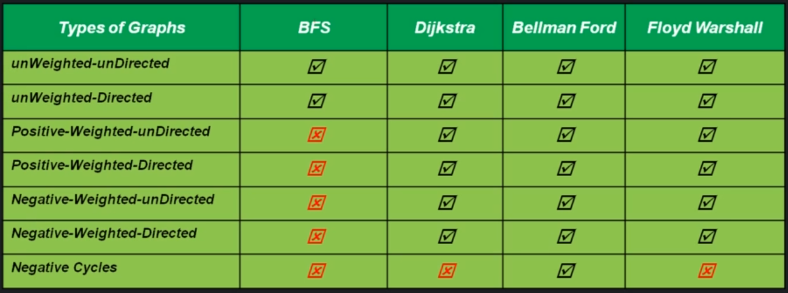
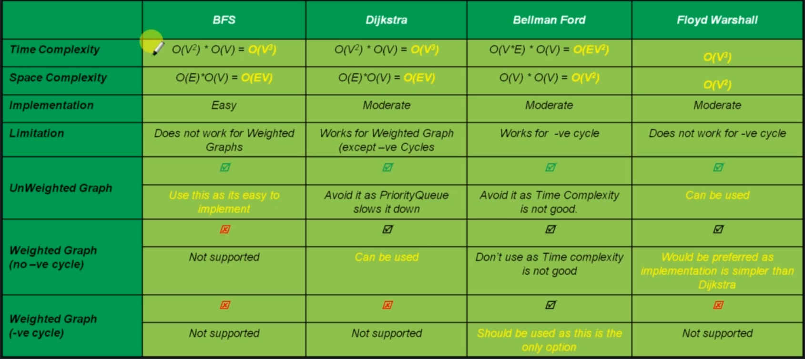

# All Pair Shortest Path (APSP) Problem

All pair shortest path problem is about finding a path between every vertex to all other vertices in a graph such that the total distance between them is minimum.

We basically do the SSSP problem for each vertex in our graph.
We can use following methods to do this:
- Breadth First Search (BFS)
- Dijkstra algorithm
- Bellman Ford algorithm
- Floyd Warshall algorithm

## Floyd Warshall Algorithm

```
FloydWarshall(G)
    initialize a table of size VxV: D with infinity
    copy D from G
    for k = 0 to n - 1 // run the loop as many times as number of vertices
        for i = 0 to n - 1 // run the loop such that we visit cell in 2D array in row wise fashion
            for j = 0 to n - 1
                if D[i][j] > D[i][k] + D[k][j]
                    D[i][j] = D[i][k] + D[k][j]
    return D

Time Complexity - O(V^3)
Space Complexity - O(V^2)
```

The Floyd Warshall algorithm will not work with negative cycles. That is because if we go through a cycle, we need to go via negative cycle participating vertex at least twice. Since we never run the loop twice via the same vertex, Floyd algorithm can never detect a negative cycle.

## Algorithm comparison


