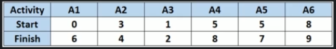
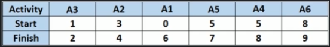

# Activity Selection Problem

We are given `n` activities with their start and finish times. Select the maximum number of activities that can be performed by a single person, assuming that a person can only work on a single activity at a time.



We can sort the table by the finish time.



Now we can go through the elements and see if we can take it or not, by simply checking if the next element's starting time is more or equal the previous element's starting time.

The answer is: `A3, A2, A5, A6`.

So the algorithm for this problem is as follows:
1. Sort the activities according to their finish time
2. Select the first activity from the sorted array and print it
3. Do following for remainint activities in the sorted array:
    - If the start time of the activity is greated or equal to the finish time of previously selected activity then select this activity and print it.

```
ActivitySelectionProblem(A)
    sort(A,finishTime) --------------------------------------------- O(n log n)
    previousActivity = first activity ------------------------------ O(1)
    print first activity ------------------------------------------- O(1)
    loop: i = 1 to n - 1 ------------------------------------------- O(n)
        if A[startTime] of i >= A[finishTime] of PreviousActivity -- O(1)
            print A[startTime], A[finishTime] ---------------------- O(1)

Time complexity - O(n log n) + O(n) = O(n log n)
Space complexity - O(1)
```