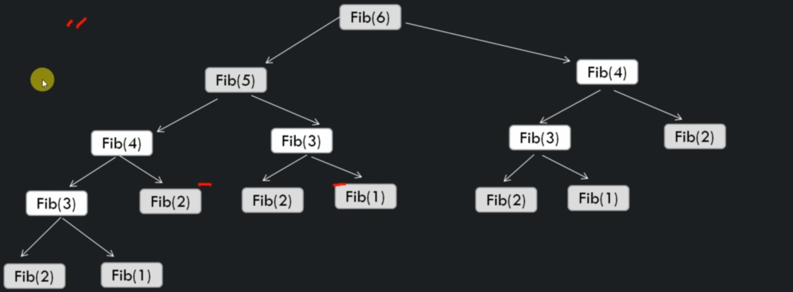

# Fibonacci series

A series of numbers in which each number (fibonacci number) is the sum of the two preceding numbers. First 2 numbers by definition are 0 and 1.

Example: 0, 1, 1, 2, 3, 5, 8, 13, 21, 34, 55, 89, 144, ...

```
FibonaccyRecursive(n)
    if(n < 1) return error // base case
    else if (n == 1) return 0
    else if (n == 2) return 1
    else return FibonacciRecursive(n - 1) + FibonnaciRecursive(n - 2)

```

So, when we need to find a value of Fib(6) we need to calculate all these values:

