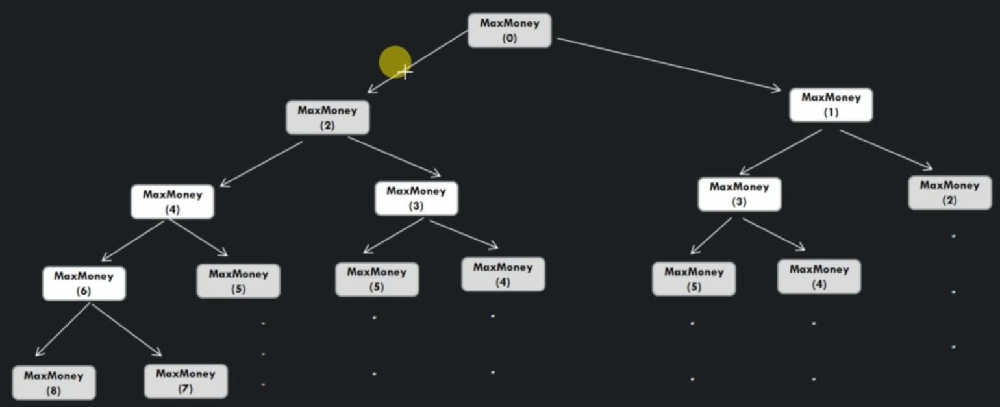

# House Thief Problem

There are N houses built in a line, each of which contains some value in it. A thief is going to steal the maximal value of these houses. But he can't steal in to adjacent houses. What is the maximum stolen value?

Example:

    Input: {6, 7, 1, 30, 8, 2, 4}
    Output: 41
    Thief will steal: House #7, 30, 4

Example 2:

    Input: {20, 5, 1, 13, 6, 11, 40}
    Output: 73
    Thief will steal: House #20, 13, 40

## Applying Magic Framework

1. Is `Greedy Choice` applicable?

    We cannot guarantee that we take a number and it will be part of the best combination to pick.

2. We can break it into similar subproblems

## Algorithm

```
private int maxMoneyRecursive( int[] HouseNetWorth, int currentIndex )

    int stealCurrentHouse = HouseNetWorth[currentIndex] + maxMoneyRecursive(HouseNetWorth, currentIndex + 2)
    int skipCurrentHouse = maxMoneyRecursive(HouseNetWorth, currentIndex + 1)

    return Math.max(stealCurrentHouse, skipCurrentHouse)
```

