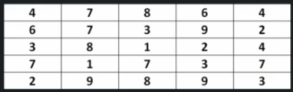

# Min cost to reach last cell in 2d array

We are given a 2D matrix, accessing each cell have a cost associated with it. We need to start from (0,0) cell and go till (n-1, n-1) cell.
Challenge is to do the traversal in minimum cost.

Example:



```
int findMinCost(int[][] cost, int row, int col)
    
    if row == -1 || col == -1
        return Integer.MAX_VALUE
    
    if row == 0 && col == 0
        return cost[0][0]

    int minCost1 = findMinCost(cost, row-1, col) // get min cost if we go up

    int minCost2 = findMinCost(cost, row, col -1) // left
    
    int minCost = integer.min(minCost1, minCost2)
    int currentCollsCost = cost[row][col]

    return minCost + currentCellsCost

```