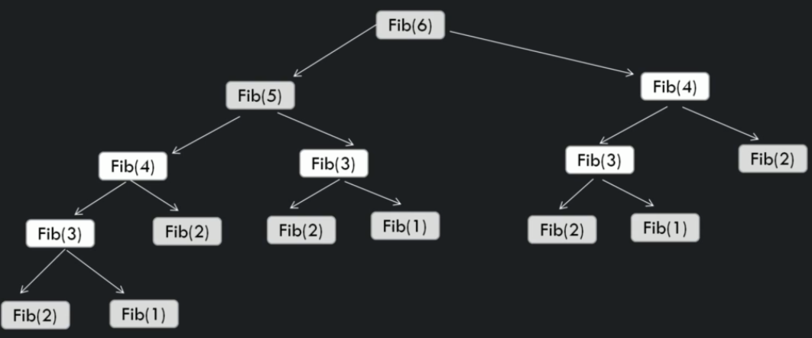
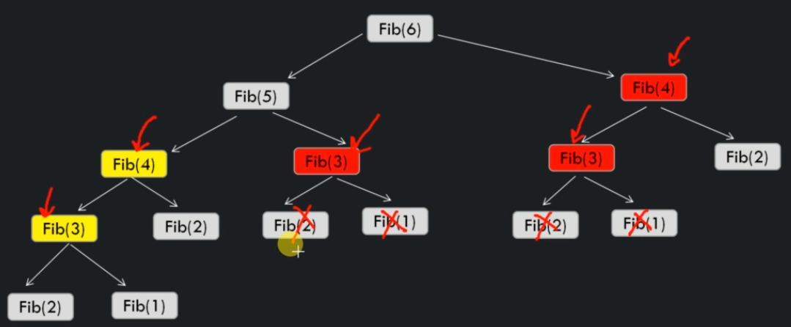

# What is dynamic programming

Dynamic programming is a method for solving a complex problem by breaking it down into a collection of simpler subproblems, solving each of those subproblems just once, and storing their solutions.

The next time the same subproblem occurs, instead of recomputing it's solution, one simply looks up the previously computed solution, thereby saving computation time at the expense of a modest expenditure in storage space.

Dynamic programming is mainly and optimization over plain divide and conquer.

## Top Down approach

We can use Fibonacci series for an example. 

```
FibonacciRecursive(n)
    if(n < 1) return error
    else if (n == 1) return 0
    else if (n == 2) return 1
    return FibonacciRecursive(n-1) + FibonacciRecursive(n-2)

Time complexity - O(1.6180)^n
Space complexity - O(n)
```



We can optimize this algorithm to memoize the results and increase the performance of the algorithm.



```
int FibonacciAux(int[] memoize, int n)
    if n < 1 return error
    else if n == 1 return 0
    else if n == 2 return 1
    
    if memoize[n] == 0
        memoize[n] = FibonacciAux(memoize, n-1) + FibonacciAux(memoize, n-2)
    
    return memoize[n]
```

The top down approach breaks the problem into smaller subproblems.
Then, these subproblems are solved and stored into memory if any of them ever comes up again.

## Bottom up approach

In bottom up approach, we evaluate the function starting with the smallest possible input arguement value and then we work our way up. While computing the values we store all the computed values in memory. As larger arguments are evaluated, precomputed values for smaller arguments can be reused.

Int this case all the subproblems that we might need in future are precomputed and then they are used to solve a bigger problem.

```
int FibonacciBottomUp(int n)

    create a new arrayTable[] of size n
    if n < 1 return error

    table[0] = 0
    table[1] = 1
    for(int i = 3; i < n; i++)
        table[i] = table[i-2] + table[i-3]
    return table[n]

Time Complexity - O(n)
Space Complexity - O(n)

```

## Divide&Conquer vs Top Down vs Bottom Up

| Problem           | Divide & Conquer | Top Down | Bottom Up |
|-------------------|------------------|----------|-----------|
| Fibonacci numbers | O(1.6180)^n      | O(n)     | O(n)      |


## Top down vs Bottom up methods

|                       | Top Down                                                                                 | Bottom Up                              |
|-----------------------|------------------------------------------------------------------------------------------|----------------------------------------|
| Ease of algorithm     | Easy to come up with solution as it is an extension of Divide & Conquer                  | Not so easy to come up with a solution |
| Run time of Algorithm | Slow                                                                                     | Fast                                   |
| Space efficiency      | Unnecessary use of extra Stack space. Can run out of stack space if computation is huge. | No stack is used                       |
| When to use           | Need a quick solution                                                                    | Need an efficient solution             |