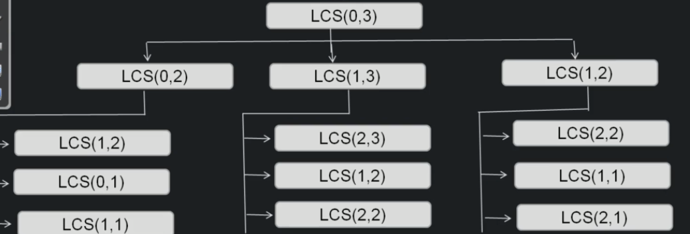

# Longest Palindromic subsequence

```
int LPSAux( String st, int startIndex, int endIndex )
    if startIndex > endIndex // dont need to traverse more than 1/2 of the string
        return 0

    if startIndex == endIndex // there is only 1 character
        return 1

    int count1 = 0

    if st.charAt(startIndex == st.charAt(endIndex))
        count1 = 2+ LPSAux(st, startIndex + 1, endIndex - 1)

    int count2 = LPSAux(st, startIndex + 1, endIndex)
    int count3 = LPSAUx(st, startIndex, endIndex - 1)

    return Max(count1, count2, count3)
```



## Top Down approach

```
int lps_Aux(int[][] dp, String string, int startIndex, int endIndex)

    if startIndex > endIndex
        return 0

    if startIndex == endIndex
        return 1

    if(dp[startIndex][endIndex] == null)

        int c3 = 0

        if string.charAt(startIndex) == string.charAt(endIndex)
            c3 = 2 + lps_Aux(dp, string, startIndex + 1, endIndex -1)

        int c1 = lps_Aux(dp, string, startIndex + 1, endIndex)
        int c1 = lps_Aux(dp, string, startIndex, endIndex - 1)

        dp[startIndex][endIndex] = Math.max(c1,c2,c3)

    return dp[startIndex][endIndex]
```

## Bottom up approach

```

int findLPSLength(String st)

    int[][] dp = new int[st.length][st.length]

    for int col = 0; col < st.length; col++
        for int row = st.length; row >= 0; row--

        if row > col
            dp[row][col] = 0
        else if row == col
            dp[row][col] = 1
        else
            if st.charAt(row) == st.charAt(col)
                dp[row][col] == Math.max(
                    2+dp[row+1][col-1], 
                    dp[row][col-1],
                    dp[row+1][col]
                )
            else
                dp[row][col] = Math.max(dp[row][col-1], dp[row+1][col])
                
    return dp[0][st.length-1]

```